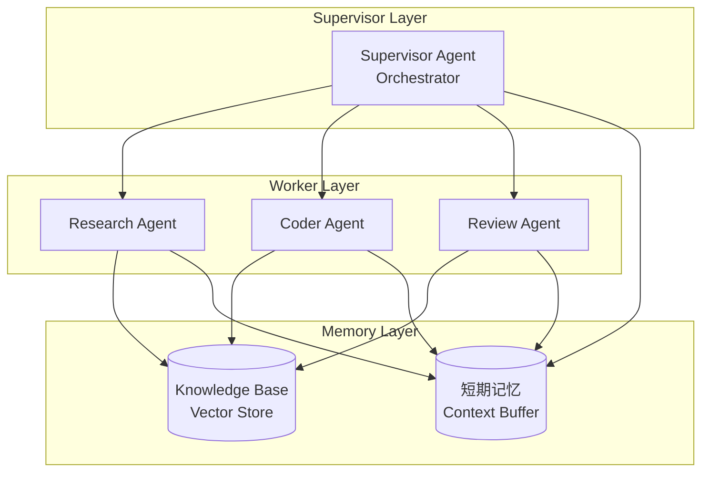

# MAS Architecture - Generation 1

## 系统拓扑图



## 组件职责

### Supervisor Agent
- 任务接收与分解
- Worker调度与结果汇总
- 质量门禁检查
- 路由决策

### Research Agent
- 信息检索与抽取
- 知识库更新
- 事实核查

### Coder Agent
- 代码生成与修复
- 测试编写
- 文档生成

### Review Agent
- 代码审查
- 性能评估
- 架构建议

## 通信协议

```
Supervisor → Worker: JSON {
    "task_id": string,
    "task_type": "research" | "code" | "review",
    "payload": object,
    "context": array
}

Worker → Supervisor: JSON {
    "task_id": string,
    "status": "success" | "fail",
    "result": object,
    "metrics": {
        "tokens": int,
        "latency_ms": int
    }
}
```

## 评估指标

| 指标 | 目标 | 当前基线 |
|------|------|----------|
| 任务完成率 | >90% | 65% |
| Token效率 | <2000/task | 2450/task |
| 平均延迟 | <30s | 45s |

## 版本历史
- v1.0: 初始架构 - Tree-based Supervisor-Worker
