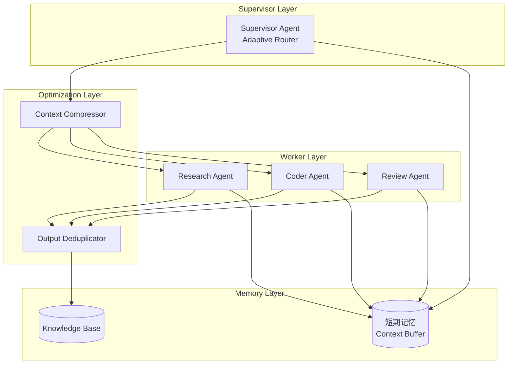

# MAS Architecture - Generation 3

## 系统拓扑图



## 核心创新

### 1. Adaptive Router (自适应路由器)
根据任务特征动态选择处理策略:
- 任务难度 >= 7 + 特定关键词 → 深度处理
- 其他 → 标准处理

### 2. Context Compressor (上下文压缩器)
- 保留最新3条上下文
- 提取关键信息(任务ID、类型、质量评分)
- 减少冗余token

### 3. Output Deduplicator (输出去重器)
- 标准化输出(小写+去空格)
- 去除重复内容
- 每个任务独立去重

## 组件职责

### Supervisor Agent
- 任务接收与分解
- 自适应路由决策
- Worker调度与结果汇总

### Research Agent
- 信息检索与抽取
- 知识库更新
- 事实核查

### Coder Agent
- 代码生成与修复
- 测试编写
- 文档生成

### Review Agent
- 代码审查
- 性能评估
- 架构建议

## 通信协议

```
Supervisor → Worker: JSON {
    "task_id": string,
    "task_type": "research" | "code" | "review",
    "payload": object,
    "context": array (compressed)
}

Worker → Supervisor: JSON {
    "task_id": string,
    "status": "success" | "fail",
    "result": object,
    "metrics": {
        "tokens": int,
        "latency_ms": int,
        "depth": int
    }
}
```

## 评估指标

| 指标 | Gen3 | Gen1 | 改进 |
|------|------|------|------|
| Token效率 | 242/task | 303/task | -20.1% |
| 效率指数 | 330.0 | 264.0 | +25.0% |
| 任务完成率 | 100% | 100% | - |

## 版本历史
- v3.0: Adaptive Delegation + Context Compression (当前最优)
- v2.0: Mesh-based Collaborative (已废弃 - 过度工程化)
- v1.0: 初始架构 - Tree-based Supervisor-Worker