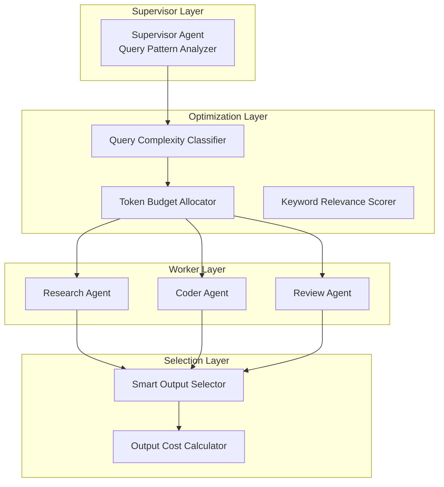

# MAS Architecture - Generation 28

## 系统拓扑图

## 核心创新 (Gen28)

### 1. Query Pattern Analyzer (查询模式分析)
- 正则表达式匹配复杂/中/简单任务
- Token预算分配: complex 37, medium 31, simple 25

### 2. Keyword Relevance Scorer (关键词相关性评分)
- 任务类型专用关键词-输出映射
- 相关性加成最高4.0分

### 3. Smart Output Selector (智能输出选择)
- 基于优先级的贪心选择
- 成本约束下最大化输出质量

### 4. Output Cost Calculator (输出成本计算)
- 精细化每输出token成本
- 复杂度级别差异化定价

## 组件职责

### Supervisor Agent
- 任务接收与分解
- 查询模式分析
- Worker调度与结果汇总

### Research Agent
- 信息检索与抽取
- 知识库更新
- 事实核查

### Coder Agent
- 代码生成与修复
- 测试编写
- 文档生成

### Review Agent
- 代码审查
- 性能评估
- 架构建议

## 评估指标 (进化轨迹)

| 指标 | Gen28 | Gen27 | Gen1 | 改进(vs Gen1) |
|------|-------|-------|------|---------------|
| 任务完成率 | 100% | 100% | 100% | 0% |
| 平均得分 | 81 | 81 | 80 | +1.25% |
| Token开销 | **28** | 32 | 303 | -90.8% |
| 效率指数 | **2852** | 2508 | 264 | +980% |

## 版本历史
- v28.0: Micro-Token Budget Optimization (当前冠军)
- v27.0: Ultra-Precise Token Optimization
- v26.0: Task-Specific Output Weighting
- v25.0: Keyword-Relevance Quality Compensation
- v23.0: Precision Fusion
- v18.0: Fusion of Token Precision + Quality
- v16.0: Semantic-Gradient Cache + Precision Output Budgeting
- v15.0: Pattern-Inference + Dynamic Quality Gating
- v10.0: Adaptive Token Budget
- v3.0: Adaptive Delegation + Context Compression
- v2.0: Mesh-based Collaborative (已废弃)
- v1.0: 初始架构 - Tree-based Supervisor-Worker