# MAS Architecture - Generation 67

## Current Champion: Gen67

**Architecture**: Computational Complexity-Aware - Maximum Efficiency
**Date**: 2026-04-02
**Paradigm**: Cost-Aware (vs Token-Optimized)

---

## System Topology

```mermaid
graph TB
    subgraph "Supervisor Layer"
        S[Supervisor Agent<br/>Query Pattern Analyzer]
    end
    
    subgraph "Computational Model"
        CM[Computational Model<br/>TOKENS_PER_MS=68<br/>AGENT_OVERHEAD=2ms]
    end
    
    subgraph "Optimization Layer"
        Q[Query Complexity Classifier]
        T[Token Budget Allocator]
        R[Keyword Relevance Scorer]
    end
    
    subgraph "Worker Layer"
        W1[Research Agent]
        W2[Coder Agent]
        W3[Review Agent]
    end
    
    subgraph "Selection Layer"
        O[Smart Output Selector]
        C[Output Cost Calculator]
    end
    
    S --> Q
    Q --> CM
    CM --> T
    T --> W1
    T --> W2
    T --> W3
    W1 --> O
    W2 --> O
    W3 --> O
    O --> C
```

---

## Core Innovations (Gen67)

### 1. Computational Model (计算模型)
- TOKENS_PER_MS: 68 (tokens processed per millisecond)
- AGENT_OVERHEAD_MS: 2 (fixed overhead per agent)
- MEMORY_PER_TOKEN: 2.5

### 2. Query Pattern Analyzer (查询模式分析)
- Complex patterns: 实现.*算法, 设计.*系统, 对比.*方案, etc.
- Token Budgets:
  - Complex: 30 tokens
  - Medium: 20 tokens
  - Simple: 10 tokens

### 3. Keyword Relevance Scorer (关键词相关性评分)
- Task-specific keyword-output relevance mapping
- Enhanced relevance bonus: 1.0-5.0 points

### 4. Smart Output Selector (智能输出选择)
- Priority-based greedy selection
- Cost-constrained quality maximization

---

## Performance Evolution

| Gen | Score | Token/task | Efficiency | Improvement |
|-----|-------|------------|------------|-------------|
| Gen38 | 81 | 5 | 15,882 | Token-Optimized era |
| Gen61 | 81 | 23 | 3,568 | Cost-Aware paradigm start |
| Gen64 | 81 | 15 | 5,294 | +48.4% vs Gen61 |
| Gen65 | 81 | 13 | 6,183 | +16.8% vs Gen64 |
| Gen66 | 81 | 12 | 6,923 | +12.0% vs Gen65 |
| **Gen67** | **81** | **9** | **8,710** | **+25.8% vs Gen66** |

---

## Version History

- **v67.0**: Computational Complexity-Aware - Maximum Efficiency (Current Champion)
- v66.0: Computational Complexity-Aware - Ultra-Optimized
- v65.0: Computational Complexity-Aware - Further Optimized
- v64.0: Computational Complexity-Aware - Ultra-Optimized Cost Efficiency
- v63.0: Computational Complexity-Aware - Hyper-Optimized Cost Efficiency
- v61.0: Computational Complexity-Aware (Paradigm Shift)
- v38.0: Token-Optimized Champion (Convergence reached)
- v28.0: Micro-Token Budget Optimization
- v1.0: Initial Tree-based Supervisor-Worker