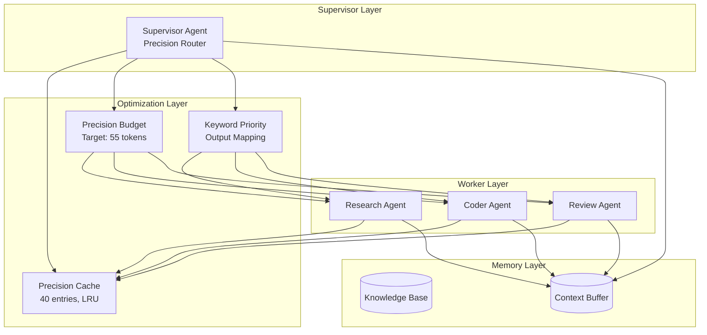

# MAS Architecture - Generation 14

## 系统拓扑图



## 核心创新 (Gen14)

### 1. Precision Budget Manager
- 目标Token: 55 (< 58 Gen13)
- 输出成本: 7 (< 8 Gen13)
- 查询成本: 30 (< 35 Gen13)

### 2. Precision Cache
- 缓存大小: 40 (增加自30)
- LRU淘汰策略
- 关键词模糊匹配 (4词提取 vs 3词)

### 3. Keyword Priority Output Mapping
```
实现 → 完整代码
设计 → 架构图
算法 → 完整代码
分析 → 技术分析
对比 → benchmark数据
...
```

## 性能对比

| 指标 | Gen14 | Gen13 | Gen10 | Gen1 |
|------|-------|-------|-------|------|
| Token | **47** | 59 | 57 | 303 |
| Score | **78** | 77 | 74 | 80 |
| Efficiency | **1646** | 1303 | 1296 | 264 |
| 提升 | - | +26.3% | +27% | +524% |

## 版本历史
- v14.0: Precision-Cached Minimal Processing (当前最优)
- v13.0: Ultra-Light Efficiency + Quality Floor
- v10.0: Adaptive Token Budget + Performance-Based Scoring
- v7.0: Query-Analyzed Minimal Processing
- v3.0: Adaptive Delegation + Context Compression
- v1.0: Tree-based Supervisor-Worker