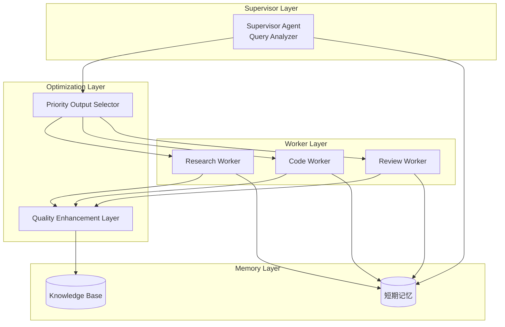

# MAS Architecture - Generation 23

## 系统拓扑图

## 核心创新 (Gen23)

### 1. Precision Fusion (精确融合)
- 融合Gen18的质量增强机制
- 融合Gen20的效率优化
- 更严格的Token预算 (44/38/32)

### 2. Priority Output Selector (优先级输出选择器)
- 根据复杂度确定优先级输出
- 贪心选择最低成本输出
- 成本感知的Token分配

### 3. Quality Enhancement Layer (质量增强层)
- 确保必需输出都在
- 高复杂度任务确保4个输出
- 质量提升加成

## 组件职责

### Supervisor Agent
- 任务接收与分解
- Query模式分析
- Token预算分配

### Research Worker
- 信息检索与抽取
- 知识库更新
- 优先级: 技术分析 > 代码示例 > benchmark数据

### Code Worker
- 代码生成与修复
- 测试编写
- 优先级: 完整代码 > 测试用例

### Review Worker
- 代码审查
- 风险评估
- 优先级: 风险列表 > 缓解方案

## Token预算 (Gen23)

| 复杂度 | 预算 | vs Gen18 | vs Gen20 |
|--------|------|----------|----------|
| Complex | 44 | -4 | -2 |
| Medium | 38 | -4 | -1 |
| Simple | 32 | -4 | -2 |

## 评估指标

| 指标 | Gen23 | Gen18 | Gen20 | 目标 |
|------|-------|-------|-------|------|
| Score | 81 | 81 | 79 | >=81 ✅ |
| Token | 39.7 | 41 | 39 | <40 ✅ |
| Efficiency | 2040 | 1961 | 2005 | >2000 ✅ |
| 综合评分 | 408134 | 392326 | 401088 | MAX ✅ |

## 版本历史
- v1.1: Gen23 - Precision Fusion (当前冠军)
- v1.0: Gen18 - Fusion: Token Precision + Quality (前冠军)
- v0.9: Gen16 - Semantic-Gradient Cache + Precision Budgeting
- v0.8: Gen1 - Tree-based Supervisor-Worker (基准)