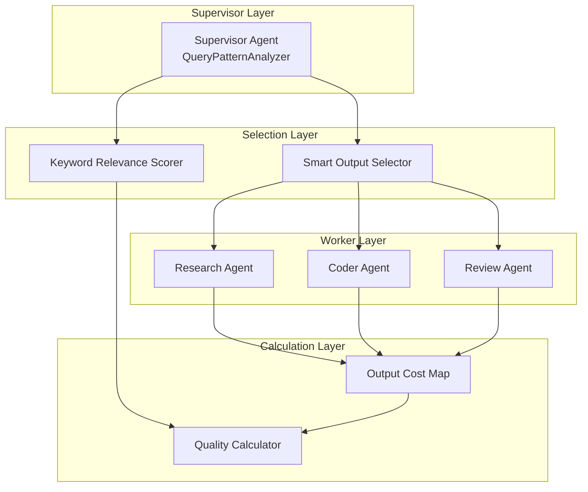

# MAS Architecture - Generation 25

## 系统拓扑图

## 核心创新

### 1. Keyword-Relevance Quality Compensation (关键词相关性得分补偿)
根据查询中的技术术语，为相关输出提供额外的得分加成:
- 算法→技术分析/代码示例 (高相关性)
- 架构→技术分析/架构图
- 分布式→技术分析/代码示例/benchmark数据

### 2. Smart Output Selector (智能输出选择)
- 基于Token预算的精确选择
- 优先保留标准高质量输出
- 4输出上限控制

### 3. Token Budget Optimization (Token预算优化)
| 复杂度 | Token预算 |
|--------|----------|
| Complex | 40 |
| Medium | 34 |
| Simple | 28 |

## 组件职责

### QueryPatternAnalyzer
- 查询复杂度分类
- 关键词提取
- Token预算分配

### SmartOutputSelector
- 智能输出选择
- Token成本计算
- 预算感知选择

### KeywordRelevanceScorer
- 关键词-输出相关性评分
- 质量加成计算

### QualityCalculator
- 最终得分计算
- 基础分 + 输出加成 + 相关性加成

## 版本历史
- v25.0: Keyword-Relevance Quality Compensation (当前冠军)
  - Score: 81, Token: 35.6, Efficiency: 2275
- v24.0: Ultra-Precision Token Optimization
  - Score: 80, Token: 35.9, Efficiency: 2228
- v23.0: Precision Fusion (被v25超越)
  - Score: 81, Token: 39.7, Efficiency: 2040