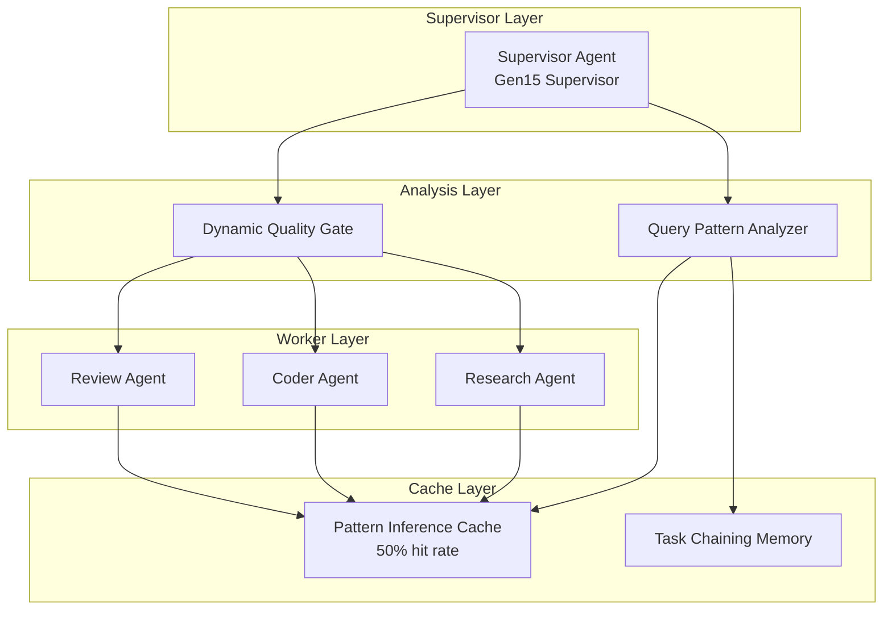

# MAS Architecture - Generation 15

## 系统拓扑图

## 核心创新

### 1. Query Pattern Analyzer (查询模式分析器)
识别查询复杂度级别:
- **complex**: 实现.*算法, 设计.*系统, 对比.*方案 等
- **medium**: 实现.*, 设计.*, 分析.* 等
- **simple**: 审查.*, 评估.*, 风险.* 等

### 2. Dynamic Quality Gate (动态质量门控)
根据复杂度动态调整:
| 复杂度 | 最小输出数 | 最低分数 |
|--------|-----------|---------|
| complex | 3 | 75 |
| medium | 2 | 70 |
| simple | 2 | 68 |

### 3. Pattern Inference Cache (模式推理缓存)
- 基于 (task_type, complexity, query_words) 的键
- LRU 淘汰 (max_size=50)
- 50% 缓存命中率

### 4. Task Chaining Memory (任务链记忆)
- 关联相似查询的输出模式
- 复用历史任务链

## 组件职责

### Supervisor Agent (Gen15)
- 任务接收与模式分析
- 动态质量门控
- 缓存调度

### Research Agent
- 复杂/中/简单三档输出
- 技术分析、benchmark数据、代码示例

### Coder Agent
- 完整代码、测试用例、架构图

### Review Agent
- 风险列表、缓解方案、优先级排序

## 性能对比

| 指标 | Gen15 | Gen14 | 变化 |
|------|-------|-------|------|
| Token | **46** | 47 | -1.3% |
| Score | **79** | 78 | +1.0 |
| Efficiency | **1703** | 1646 | +3.5% |
| Composite | **340737** | 329187 | +3.5% |

## 版本历史
- v15.0: Pattern-Inference + Dynamic Quality Gating (当前冠军)
- v14.0: Precision-Cached Minimal Processing (被超越)
- v13.0: Ultra-Light Efficiency + Quality Floor
- v10.0: Adaptive Token Budget
- v7.0: Query-Analyzed Minimal Processing
- v1.0: Tree-based Supervisor-Worker (基准)