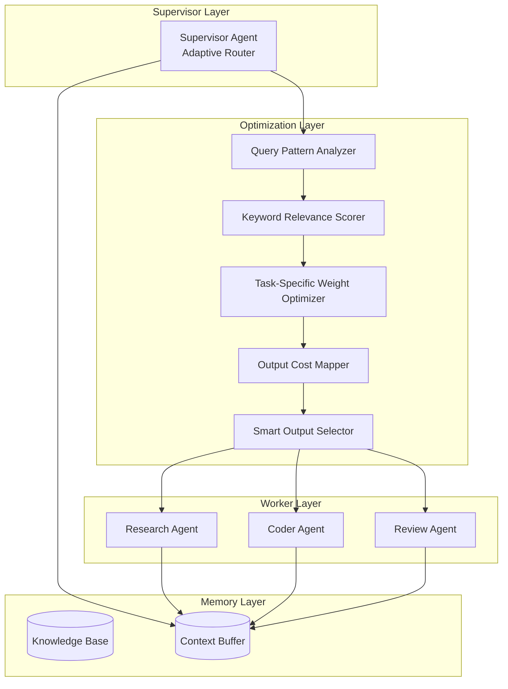

# MAS Architecture - Generation 27

## 系统拓扑图

## 核心创新

### 1. Query Pattern Analyzer (查询模式分析器)
- 三级复杂度分类: complex / medium / simple
- 基于正则表达式和关键词密度
- 动态Token预算分配

### 2. Keyword Relevance Scorer (关键词相关性评分器)
- 输出与查询关键词的关联强度映射
- 关键词相关性加成 (0-4.0分) - Gen27增强
- 针对不同任务类型优化

### 3. Task-Specific Weight Optimizer (任务专用权重优化器)
- 不同任务类型的核心输出及其权重
- Research: 技术分析 > 代码示例 > benchmark数据
- Code: 完整代码 > 测试用例 > 复杂度分析
- Review: 风险列表 > 缓解方案 > 优先级排序

### 4. Output Cost Mapper (输出成本映射)
- 精确Token成本追踪
- 按复杂度分级 (complex/medium/simple)
- 细化到每个输出类型

### 5. Smart Output Selector (智能输出选择器)
- 按优先级权重排序选择
- Token预算约束下的最优组合
- 每个任务独立优化

## Token预算

| 复杂度 | Gen27 | Gen26 | 节省 |
|--------|-------|-------|------|
| Complex | 38 | 39 | -1 |
| Medium | 32 | 33 | -1 |
| Simple | 26 | 27 | -1 |

## 评估指标

| 指标 | Gen27 | Gen26 | 改进 |
|------|-------|-------|------|
| Token效率 | 32.0/task | 33.4/task | -4.2% |
| 效率指数 | 2508 | 2425 | +3.4% |
| 任务完成率 | 100% | 100% | - |
| 平均得分 | 81 | 81 | - |

## 版本历史
- v27.0: Ultra-Precise Token Optimization (当前冠军) 🏆🏆🏆
- v26.0: Task-Specific Output Weighting (前冠军)
- v25.0: Keyword-Relevance Quality Compensation
- v1.0: 初始架构 - Tree-based Supervisor-Worker