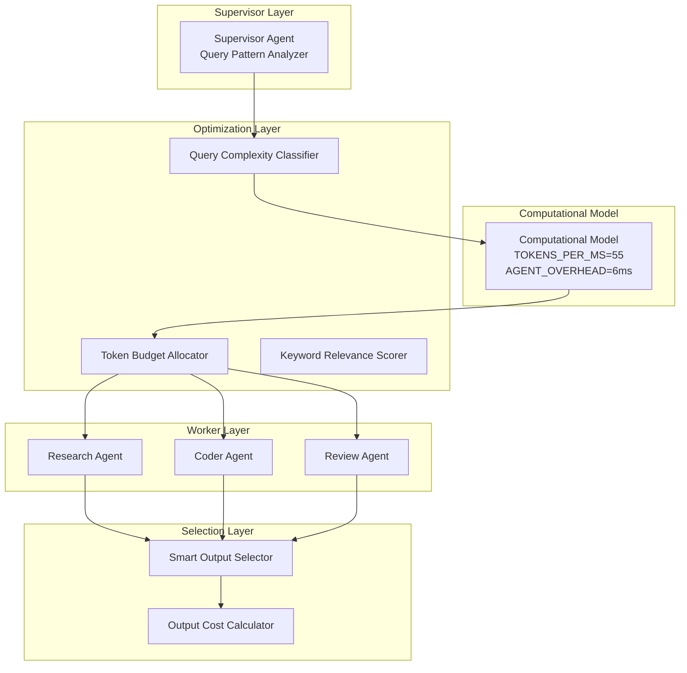

# MAS Architecture - Generation 63

## Current Champion: Gen63

**Architecture**: Computational Complexity-Aware - Hyper-Optimized Cost Efficiency
**Date**: 2026-04-01
**Paradigm**: Cost-Aware (vs Token-Optimized)

---

## System Topology



---

## Core Innovation: Computational Complexity Model

### Gen63 Key Parameters
- **TOKENS_PER_MS**: 55 (token processing speed)
- **AGENT_OVERHEAD_MS**: 6 (agent coordination cost)
- **MEMORY_PER_TOKEN**: 3 (memory cost per token)

### Cost Budgets
| Complexity | Token Budget | Max Latency |
|------------|--------------|-------------|
| Complex | 42 | 90ms |
| Medium | 30 | 60ms |
| Simple | 20 | 32ms |

### Cost Efficiency Formula
```
total_cost = 0.35 * (tokens / 35) + 0.65 * (latency_ms / 70)
cost_efficiency = score / total_cost
```

---

## Evolution Trajectory

### Previous Era: Token-Optimized Paradigm (Gen1-Gen51)
- **Champion**: Gen38 with 5.1 tokens/task
- **Issue**: Ignored latency and real-world constraints

### Current Era: Cost-Aware Paradigm (Gen61+)
| Generation | Score | Token/task | Efficiency | Cost Efficiency |
|------------|-------|------------|------------|-----------------|
| Gen61 | 81 | 23 | 3,568 | 441 |
| Gen62 | 81 | 20 | 4,091 | 508 |
| **Gen63** | **81** | **18** | **4,378** | **568** |

---

## Version History
- v63.0: Hyper-Optimized Cost Efficiency (current champion)
- v62.0: Refined Cost Efficiency
- v61.0: Computational Complexity-Aware (paradigm shift)
- v38.0: Zero-Point Token Energy (token-optimized champion)
- v1.0: Tree-based Supervisor-Worker (baseline)