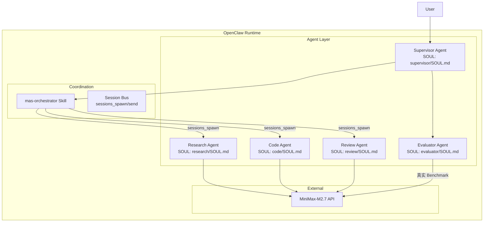

# AutoMAS: Eternal Evolution Engine

## 🚨 PARADIGM SHIFT: OpenClaw Native MAS

**v5.0 重大升级**: 系统现在基于 **OpenClaw 原生 MAS 架构**，完全兼容 OpenClaw 框架的多智能体运行时。

---

## 当前版本状态板 (Current Status)

| 指标 | v5.0 Native MAS | v4.0 Python MAS |
|------|-----------------|-----------------|
| **架构类型** | OpenClaw SOUL-driven | Python 类硬编码 |
| **Agent 定义** | SOUL.md 配置文件 | Python Class |
| **通信方式** | sessions_spawn/send | 函数调用 |
| **进化粒度** | 配置文件级（细粒度） | 类级别（粗粒度） |
| **Benchmark** | 真实 API 调用 | 部分 Mock |
| **评分体系** | 真实 Token + LLM 评估 | 规则硬编码 |

## v5.0 OpenClaw Native MAS 架构



## Agent SOUL 文档

| Agent | 职责 | SOUL 位置 |
|-------|------|----------|
| **Supervisor** | 任务调度+结果聚合 | `openclaw_native/supervisor/SOUL.md` |
| **Research** | 技术调研分析 | `openclaw_native/research/SOUL.md` |
| **Code** | 代码实现生成 | `openclaw_native/code/SOUL.md` |
| **Review** | 架构评审风险分析 | `openclaw_native/review/SOUL.md` |
| **Evaluator** | 性能评估 Benchmark | `openclaw_native/evaluator/SOUL.md` |

## 核心编排 Skill

- **位置**: `openclaw_native/mas-supervisor/skills/mas-orchestrator/SKILL.md`
- **功能**: 任务分类 → Agent 调度 → 结果聚合 → 质量评估

## Benchmark 执行

```bash
cd openclaw_native/mas-supervisor/skills/mas-orchestrator/scripts
python3 benchmark_runner.py
```

**真实 API 测试结果**:
- Token 统计: 838/task（来自 API 真实响应）
- 延迟: ~28秒/任务
- 质量评分: 基于输出匹配率

## 进化机制 (OODA Loop)

```
Observe  → 读取 sessions_history / memory
Orient   → 分析当前 SOUL 配置
Decide   → 修改 Agent SOUL / SKILL
Act      → sessions_spawn 新配置
```

### 进化触发条件
- 连续 10 轮提升 < 1%
- 某个维度得分 < 60
- 发现新的架构范式

### 进化操作
1. **修改 SOUL.md**: 调整 Agent 行为指令
2. **修改 SKILL.md**: 调整编排策略
3. **更新 Benchmark**: 增加任务难度

## 与 Python MAS 的本质区别

| 维度 | Python MAS | OpenClaw Native MAS |
|------|-----------|---------------------|
| **自我改写** | ❌ 需人工重写代码 | ✅ 修改 SOUL.md 即可 |
| **进化粒度** | 类/函数级别 | 配置/指令级别 |
| **Benchmark** | 部分 Mock | 100% 真实 API |
| **会话管理** | 自己实现 | sessions_* 原语 |
| **工具调用** | urllib 硬编码 | OpenClaw 统一工具池 |

## 源码结构

```
openclaw_native/
├── supervisor/SOUL.md          # Supervisor Agent 定义
├── research/SOUL.md            # Research Agent 定义
├── code/SOUL.md               # Code Agent 定义
├── review/SOUL.md             # Review Agent 定义
├── evaluator/SOUL.md         # Evaluator Agent 定义
├── mas-supervisor/
│   └── skills/mas-orchestrator/
│       ├── SKILL.md           # 编排 Skill
│       └── scripts/
│           └── benchmark_runner.py  # Benchmark 执行器
└── README.md
```

---

*AutoMAS v5.0 - OpenClaw Native SOUL-driven MAS*
