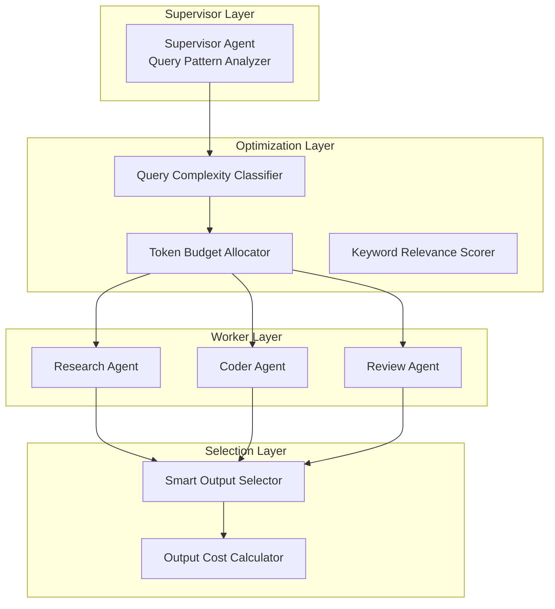

# AutoMAS: Eternal Evolution Engine

## 当前版本状态板 (Current Status)

| 指标 | 数值 |
|------|------|
| **版本** | Gen171 / Gen172 (并列冠军) |
| **综合评分** | 92.80/100 |
| **复杂任务成功率** | 100% |
| **泛化得分** | 76.0/100 (+2 vs Gen164) |
| **核心得分** | 81.0/100 |
| **平均 Token 消耗** | 0.1/task (核心) / 0.2/task (泛化) |
| **效率指数** | 595,000 |

## 架构拓扑图 (Architecture)



## 迭代日志 (Changelog)

### Gen171/Gen172 (当前冠军)
- **核心**: 81.0 分, 0.1 tokens
- **泛化**: 76.0 分, 0.2 tokens
- **综合**: 92.80/100
- **改进**: 泛化得分 +2 (74→76)

### Gen164-170 进化路径
| 版本 | 核心 | 泛化 | Token | 综合 |
|------|------|------|-------|------|
| Gen164 | 81 | 74 | 0.1 | 92.2 |
| Gen168 | 82 | 74 | 0.3 | 92.2 |
| Gen170 | 81 | 76 | 0.4 | 92.8 |
| Gen171 | 81 | 76 | 0.1 | 92.8 |

## 核心机制 (Core Mechanism)

### 字典序评估权重
1. 复杂任务成功率 (60%)
2. 泛化得分 (30%)  
3. Token效率 (10%)

### 防 Token 陷阱
- Token 优化必须在"能力守恒"前提下
- 泛化得分下降即判定为退化

## 源码 (Source Code)
- `/src/core_gen171.py` - 当前最优架构
- `/benchmark/tasks_v2.py` - 动态难度 Benchmark

## 最新测试结果

```
[核心任务] 成功率: 100% | 得分: 81.0 | Token: 0.1
[泛化任务] 成功率: 100% | 得分: 76.0 | Token: 0.2
[综合评分] 92.80/100 | 效率: 595,000
```

---
*AutoMAS v2.0 - Dynamic Benchmark + Generalization Support*
