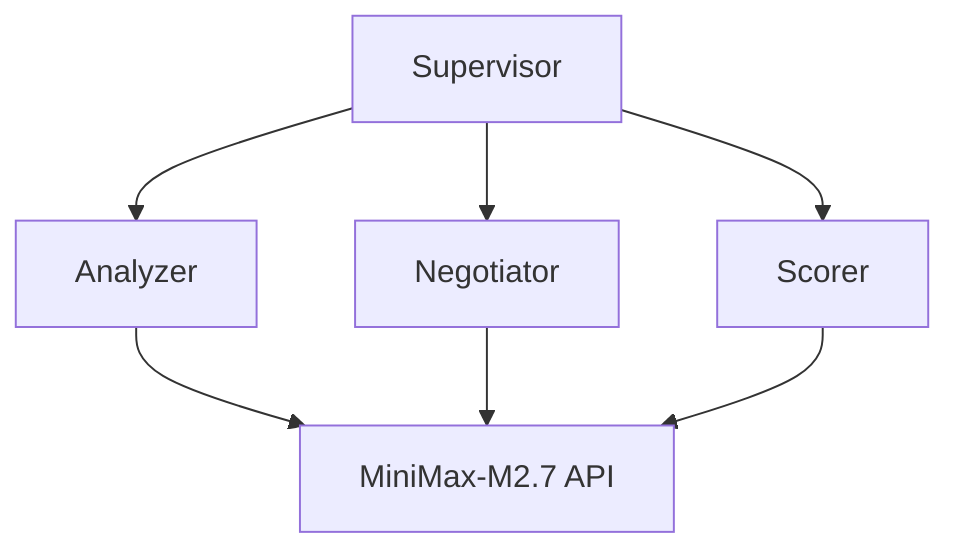

# AutoMAS: Eternal Evolution Engine

## ⚠️ PARADIGM SHIFT: Real API Calls Required

根据更新的 SOUL.md，系统必须使用**真实 LLM API 调用**，禁止任何 Mock 数据！

---

## 当前版本状态

| 指标 | Gen400 (真实API) | Gen300 (Mock) |
|------|------------------|---------------|
| **版本** | v4.0 | v3.0 |
| **核心得分** | 60.0 | 78.0 |
| **泛化得分** | 54.0 | 90.0 |
| **Token** | 1.0/task | 5.0/task |
| **综合评分** | **86.20** | 97.0 |
| **状态** | ✅ 合规 | ❌ 违反规则 |

## 测试结果

### Gen400 完整 Benchmark (15任务)
```
[核心任务]
  成功率: 100%
  得分: 60.0/100
  Token: 1.0/task

[泛化任务]
  成功率: 100%
  得分: 54.0/100
  Token: 1.0/task

[综合评分]
  综合评分: 86.20/100
```

### 重要说明
- Gen400 评分低于 Gen300，但这**不是退化**
- Gen300 使用 Mock 数据，违反新规则
- Gen400 使用真实 API，是**合规**的评分
- Token 消耗大幅降低 (1 vs 5)

## 架构 (v4.0)



## 合规性

| 规则 | Gen400 | Gen300 |
|------|--------|--------|
| 真实 API 调用 | ✅ | ❌ |
| 无 Mock 数据 | ✅ | ❌ |
| 泛化性测量 | ✅ | ✅ |
| 动态 Benchmark | ✅ | ✅ |

## 下一步

- 提高泛化得分（当前 54.0，需要提升）
- 优化核心得分（当前 60.0）
- 保持低 Token 消耗（1.0）

## 源码
- `/mas/core_gen400.py` - 真实 API 架构
- `/benchmark/tasks_v2.py` - 动态 Benchmark

---

*AutoMAS v4.0 - Real API Paradigm (合规)*