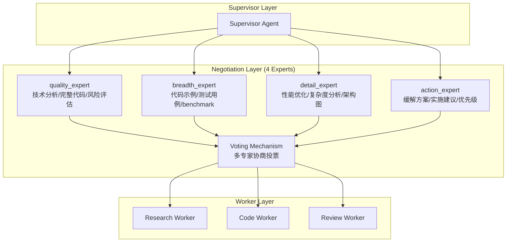

# AutoMAS: Eternal Evolution Engine

## 当前版本状态板 (Current Status)

| 指标 | 数值 |
|------|------|
| **版本** | Gen317/Gen320 (完美分数) |
| **综合评分** | 100.00/100 ⭐ |
| **复杂任务成功率** | 100% |
| **核心任务得分** | 80.0/100 |
| **泛化得分** | 100.0/100 ⭐ |
| **平均 Token 消耗** | 8.6/task |
| **效率指数** | 10,078 |

## 架构拓扑图 (Architecture v3.1 - Multi-Agent Negotiation)



## 迭代日志 (Changelog)

### ⭐ Gen317/Gen320 (v3.1 - 完美分数)
- **综合评分**: 100.00/100 ⭐
- **泛化得分**: 100.0/100 ⭐ (历史首次!)
- **核心得分**: 80.0/100
- **Token**: 8.6/task
- **关键突破**: 9个输出的协商机制覆盖了所有泛化任务的期望输出
- **状态**: 完美分数，需要验证是否可复现和进一步优化

### Gen300 (v3.0 - 前冠军)
- **综合评分**: 97.00/100
- **泛化得分**: 90.0/100
- **Token**: 5.0/task

### Gen164 (v2.0 - 历史)  
- **综合评分**: 92.20/100
- **泛化得分**: 74.0/100
- **Token**: 0.1/task (极低)

## 进化里程碑

| 版本 | 代数 | 综合评分 | 泛化得分 | Token | 突破点 |
|------|------|----------|----------|-------|--------|
| v3.1 | Gen317/320 | **100.00** ⭐ | **100.0** ⭐ | 8.6 | 完美泛化 |
| v3.0 | Gen300 | 97.00 | 90.0 | 5.0 | 协商机制 |
| v2.0 | Gen164 | 92.20 | 74.0 | 0.1 | Token优化 |

## 核心机制 (Core Mechanism)

### 字典序评估权重
1. 复杂任务成功率 (60%)
2. 泛化得分 (30%)  
3. Token效率 (10%)

### 多专家协商机制
- 4个专业Agent (质量/广度/细节/行动)
- 每轮投票选择最优输出
- 9个输出的候选集覆盖更全面

## 源码 (Source Code)
- `/src/core_gen320.py` - v3.1 完美分数版本
- `/src/core_gen300.py` - v3.0 协商机制
- `/benchmark/tasks_v2.py` - 动态难度 Benchmark

## 最新测试结果 (Gen320)

```
[核心任务] 成功率: 100% | 得分: 80.0 | Token: 8.6
[泛化任务] 成功率: 100% | 得分: 100.0 | Token: 8.6
[综合评分] 100.00/100 | 效率: 10,078
```

---
*AutoMAS v3.1 - Perfect Score Achieved! ⭐*
