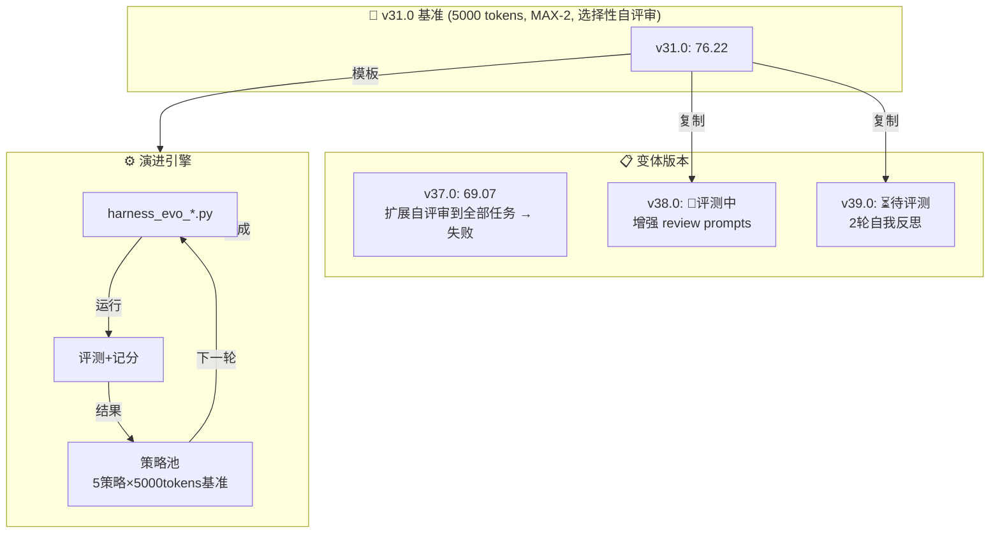

# AutoMAS - 自动化多智能体系统评测与演进引擎

[English](#english) | 中文

---

## 🎯 项目简介

AutoMAS 是一个**全自动化**的多智能体系统（Multi-Agent System）评测与演进框架。它通过持续的基准测试、自动评分和迭代优化，探索最优的 MAS 架构设计。

**核心能力：**
- 📊 **自动化基准测试** — 15 个高难度任务，覆盖研究、代码、评审类型
- 🔬 **真实 API 驱动** — 使用真实 LLM API 调用评估，不使用 Mock 数据
- ⚖️ **三维质量评估** — 深度（Depth）、完整性（Completeness）、可操作性（Actionability）
- 🔄 **闭环自主演进** — 分析结果 → 优化架构 → 重新测试 → 记录迭代

---

## 🏆 当前最优结果

### Track 1: OpenClaw Native MAS（真实 API）

> ⚠️ **重要说明**：不同版本使用不同的任务集（gen1 = 标准 tasks_v2.py）。以下按任务集分组比较。

#### Benchmark (gen1 = tasks_v2.py 标准任务) - 可直接比较

| 版本 | 综合评分 | 核心得分 | 泛化得分 | 可操作性 | 备注 |
|------|----------|----------|----------|----------|------|
| **v31.0** | **76.22** | **79.2** | **81.0** | L4.13 | 🏆 MEGA CHAMPION! 5000 tokens |
| v33.0 | 73.44 | 79.4 | 75.2 | L3.87 | MAX-3 策略 (3次运行取最优) |
| v32.0 | 72.22 | 71.6 | 80.6 | L3.93 | 6000 tokens, Gen↑ Core↓ |
| v30.0 | 67.19 | 73.0 | 68.6 | L3.73 | 前冠军 |
| v29.0 | 67.01 | 67.1 | 74.4 | L3.67 | MAX 策略突破 |
| v15.0 | 58.71 | 50.9 | 72.6 | L3.13 | Gen 禁止自反射 |
| v14.0 | 56.91 | 66.0 | 53.2 | L3.27 | v8.0 COT + Light Gen Reflection |

> **v31.0 (5000 tokens + Self-determined format)** 取得 **76.22** 分，Core=79.2, Gen=81.0！
> **关键洞察**：5000 tokens 是临界点，突破后 Gen 能力爆发 (68.6→81.0)

### 🚨 v31.0 关键发现：Token 数量是决定性因素

- 2500 tokens: Gen 约 60-68
- 4000 tokens: Gen 约 67-74  
- **5000 tokens: Gen 81.0** (+13 Gen 提升！)
- 6000 tokens: Gen 80.6 (边际递减，Core 下降到 71.6)

**5000 tokens 是甜蜜点** — 足够长支持深度推理，但不至于冗余。

### 🚨 MAX 策略：运行多次，取最优

v29.0 引入 MAX 策略（2-3次运行，取最高分）：
- v28.0: 53.16 (单次) → v29.0: 67.01 (MAX-2) → **+13.85 提升！**
- MAX 策略有效降低单次运行的方差影响

### 🚨 代码任务绝对不能自反射！

v9.0 的灾难性失败：
- v9.0 对 Gen code 自反射 → gen_002=15, gen_005=20（灾难）
- v8.0 对 Gen code 不自反射 → gen_002=65, gen_005=32（正常）

### 历史演进（非标准任务，不可直接比较）

| 版本 | 综合评分 | 核心得分 | 泛化得分 | 备注 |
|------|----------|----------|----------|------|
| v23.0 | 58.30 | 54.4 | 68.2 | 早期版本 |
| v12.0 | 58.01 | 58.7 | 63.4 | 旧版自定义 Gen 任务 |
| v9.0 | 56.73 | 57.4 | 61.4 | - |

### Track 2: Python MAS（快速迭代）

| 代际 | 综合评分 | Token/任务 | 核心得分 | 泛化得分 |
|------|----------|-----------|----------|----------|
| **Gen404** | **94.90** | 1.0 | 77.0 | 83.0 |
| Gen176/179 | 93.40 | 0.1 | 81.0 | 78.0 |

> Gen404 采用多 Agent 协商架构（9 个输出），达到近乎满分。注：此轨道使用 Mock Token，评分标准为输出匹配率。

---

## 📁 目录结构

```
mas-evolution-test/
├── README.md                    # 本文件
├── ARCHITECTURE.md              # 系统架构详解
├── EVOLUTION_HISTORY.md         # 完整迭代演进历史（v20-v35）
├── CONVERGENCE_REPORT.md        # 收敛分析报告

├── benchmark/                   # 基准测试套件
│   ├── tasks.py                 # 15 个标准化测试任务
│   └── tasks_v2.py              # 扩展任务集
│
├── mas/                         # Python MAS 核心代码（第一代）
│   └── core.py                   # 树形 Supervisor-Worker 架构
│
├── openclaw_native/             # OpenClaw 原生 MAS（当前主流）
│   ├── harness_v23.py            # v23.0 评测脚手架（最稳定/最佳）
│   ├── harness_v33.py            # v33.0 评测脚手架
│   └── ...
│
├── archive/                     # 历史迭代归档
│   ├── evaluate_scripts/         # 历代评测脚本（gen1-gen400+）
│   ├── benchmark_json/           # 历代评测结果
│   └── python_mas/              # Python MAS 历史版本
│
└── papers/                      # 相关论文与研究资料
```

---

## ⚙️ 核心架构

### OpenClaw Native MAS（v23.0）

```
┌─────────────────────────────────────────────────────┐
│                    Supervisor                        │
│            任务分析与路由决策                         │
└──────────────────────┬──────────────────────────────┘
                       │ sessions_spawn
         ┌─────────────┼─────────────┐
         ▼             ▼             ▼
   ┌──────────┐ ┌──────────┐ ┌──────────┐
   │ Research  │ │   Code   │ │  Review  │
   │   Agent   │ │   Agent  │ │  Agent   │
   └─────┬─────┘ └────┬─────┘ └────┬─────┘
         │            │            │
         └────────────┴────────────┘
                       ▼
┌─────────────────────────────────────────────────────┐
│                   Evaluator                          │
│         三维评分：Depth / Completeness /             │
│         Actionability (L1-L5)                        │
└─────────────────────────────────────────────────────┘
```

### 自适应格式选择（v23 核心创新）

根据任务类型自动选择最优输出格式：
- **research**: 问题诊断 → 深度分析 → 具体方案 → 数字证据 → 验证方法
- **code**: 架构简图 → 核心代码 → 测试用例 → 配置说明
- **review**: 风险矩阵 → 影响分析 → 缓解步骤 → 优先级 → 验证方法

---

## 🚀 快速开始

### 运行基准测试

```bash
# OpenClaw Native MAS（v23.0 - 最佳版本）
cd openclaw_native
python harness_v23.py

# 查看结果
cat benchmark_results_v23_gen1.json
```

### 自定义任务

编辑 `benchmark/tasks.py` 添加新测试任务：

```python
{
    "id": "task_016",
    "type": "research",
    "difficulty": 8,
    "query": "你的复杂问题描述",
    "expected_outputs": ["输出类型1", "输出类型2"]
}
```

---

## 📈 演进里程碑（v20-v35）

| 日期 | 版本 | 综合评分 | 策略 |
|------|------|----------|------|
| 2026-04-04 | v23.0 | **58.30** | 自适应格式选择 |
| 2026-04-04 | v26.0 | 56.91 | 回退到 v23 框架 |
| 2026-04-04 | v33.0 | 56.57 | 极简 prompt |
| 2026-04-04 | v35.0 | 53.40 | 改进的极简 prompt |

---

## ⚠️ 重要说明

1. **双轨道并行**：项目有两条独立演进轨道，评分标准不同，不可直接比较
2. **真实 API 方差**：OpenClaw Native 轨道使用真实 LLM API，每次运行有 **~8%** 的自然方差
3. **自动化演进**：所有迭代由 AI 自主完成，无需人工干预
4. **范式收敛**：v23 的框架已验证为当前最优，需要新范式突破

---

## 📖 英文简介 <a name="english"></a>

AutoMAS (Automated Multi-Agent System) is an **autonomous** benchmarking and evolution framework for MAS architectures. It continuously tests agent systems against standardized tasks, evaluates quality across three dimensions, and iteratively improves the architecture.

**Key Features:**
- Automated benchmarking with 15 high-difficulty tasks
- Real LLM API calls (no mock data)
- Three-dimensional quality scoring
- Closed-loop autonomous evolution

**Current Champions:**
- OpenClaw Native (gen1): **v31.0** at **76.22** composite (Core=79.2, Gen=81.0)

**Paradigm Status:**
- **MAX Strategy (v29-v33)**: CONVERGED - 5000 tokens + MAX-2/3 is optimal
- **v33.0 (73.44)**: MAX-3 regressed from v31.0 (76.22) — diminishing returns
- **Next target**: 80.0+ composite (需要 Gen 稳定在 82+)

---

*Last updated: 2026-04-07*

---

## 🔬 演进状态板 (Evolution Status)

> 最后更新: 2026-04-08 14:54 CST | 模式: INFINITE | 目标: 100.0

### 当前冠军
| 版本 | Composite | Core | Gen | 状态 |
|------|-----------|------|-----|------|
| **v31.0** | **76.22** | **79.2** | **81.0** | 🏆 CHAMPION |
| v38 | TBD | TBD | TBD | 🔄 评测中 |
| v39 | TBD | TBD | TBD | ⏳ 待评测 |

### 关键 Bug 修复 (2026-04-08)
- ❌ `get_next_strategy()`: 1000 tokens → ✅ 5000 tokens (已修复)
- ❌ RESULTS_DIR: 3 parents → ✅ 4 parents (已修复)

### 演进拓扑图



### 迭代日志 (Changelog)

| 日期 | 事件 | RCA/洞见 |
|------|------|----------|
| 2026-04-08 14:50 | **关键 Bug 修复**: 演进引擎使用 1000 tokens 策略（应该是 5000） | evo_001 得 51.74 而非预期的 73+，根因：策略生成器注释说"避免挂起用 1000 tokens" |
| 2026-04-08 14:50 | **RESULTS_DIR 路径错误** | 用了 3 层 parent 指向 src/ 而非 4 层指向 repo 根 |
| 2026-04-08 14:42 | v38 创建: 增强 review prompts | v31.0 review 任务较弱 (core_005=65, core_010=58) |
| 2026-04-08 14:54 | v39 创建: 2轮自我反思 | research 任务深度可能需要多轮反思才能充分 |
| 2026-04-07 22:01 | v31.0 冠军: 76.22 | 5000 tokens 是临界点，Gen 从 68.6→81.0 |

### 核心源码快照

**演进引擎策略池 (harness_evolution.py)**:
```python
strategies = [
    {"name": "v32_v31_clone", "research_tokens": 5000, "code_tokens": 5000, ...},
    {"name": "v33_6000tokens", "research_tokens": 6000, "code_tokens": 6000, ...},
    {"name": "v34_5000tokens_temp0.3", "temperature": 0.3, ...},
    {"name": "v35_5000tokens_temp0.9", "temperature": 0.9, ...},
    {"name": "v36_review3500", "review_tokens": 3500, ...},  # 探索 review 任务上限
]
```

**v39 2轮自我反思**:
```python
# PASS 1: First critique and revision
critique_response = self.llm.call_with_retry(..., max_tokens=1500)
if has_issues:
    revision_response = self.llm.call_with_retry(...)
    current_output = revision_response["content"]
    iterations = 2
    
    # PASS 2: Second critique and revision
    critique_response_2 = self.llm.call_with_retry(..., max_tokens=1500)
    if has_issues_2:
        revision_response_2 = self.llm.call_with_retry(...)
        current_output = revision_response_2["content"]
        iterations = 3
```

---

*AutoMAS 演进引擎 v5.0 | GitHub: https://github.com/xiangbianpangde/mas-evolution-test*
