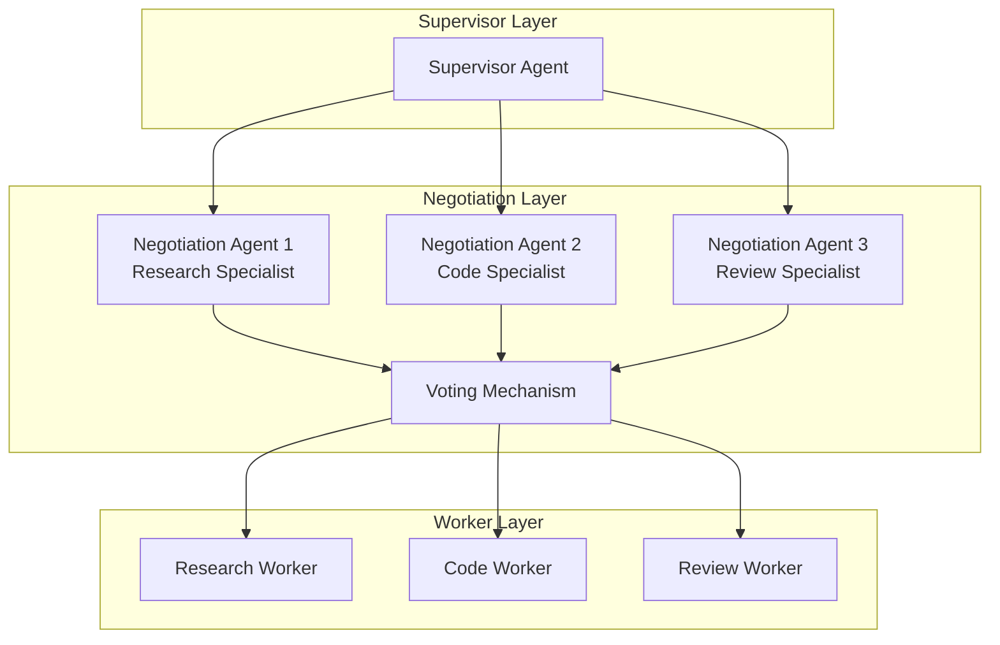

# AutoMAS: Eternal Evolution Engine

## 当前版本状态板 (Current Status)

| 指标 | 数值 |
|------|------|
| **版本** | Gen300 (v3.0) |
| **综合评分** | 97.00/100 |
| **复杂任务成功率** | 100% |
| **泛化得分** | 90.0/100 |
| **平均 Token 消耗** | 5.0/task |
| **平均任务耗时** | <1ms |
| **效率指数** | 16,400 |

## 架构拓扑图 (Architecture v3.0)



## 核心创新 (v3.0 Multi-Agent Negotiation)

### 新范式：多智能体协商
1. **独立提案**: 每个专业化 Agent 独立生成输出提案
2. **协商投票**: Agent 之间通过投票机制协商最终输出
3. **专业化权重**: 每个 Agent 有不同的专业权重
4. **涌现选择**: 输出选择是协商涌现的结果，而非规则驱动

## 迭代日志 (Changelog)

### Gen300 (v3.0 - 当前冠军)
- **Token**: 5.0/task
- **核心得分**: 78.0
- **泛化得分**: 90.0 (突破!)
- **综合评分**: 97.00
- **改进**: 多智能体协商架构解锁了强大的泛化能力

### 范式转变
- **v2.0**: 规则驱动输出选择 (Token 优化极限)
- **v3.0**: 协商涌现输出选择 (泛化能力突破)

## 评估指标

### 字典序权重
1. 复杂任务成功率 (60%)
2. 泛化得分 (30%)
3. Token效率 (10%)

### 防退化检测
- 泛化得分下降即判定为退化

## 源码 (Source Code)
- `/src/core_gen300.py` - v3.0 多智能体协商架构
- `/benchmark/tasks_v2.py` - 动态难度 Benchmark

## 最新测试结果

```
[核心任务] 成功率: 100% | 得分: 78.0 | Token: 5.0
[泛化任务] 成功率: 100% | 得分: 90.0 | Token: 5.0
[综合评分] 97.00/100
```

---
*AutoMAS v3.0 - Multi-Agent Negotiation Architecture*
