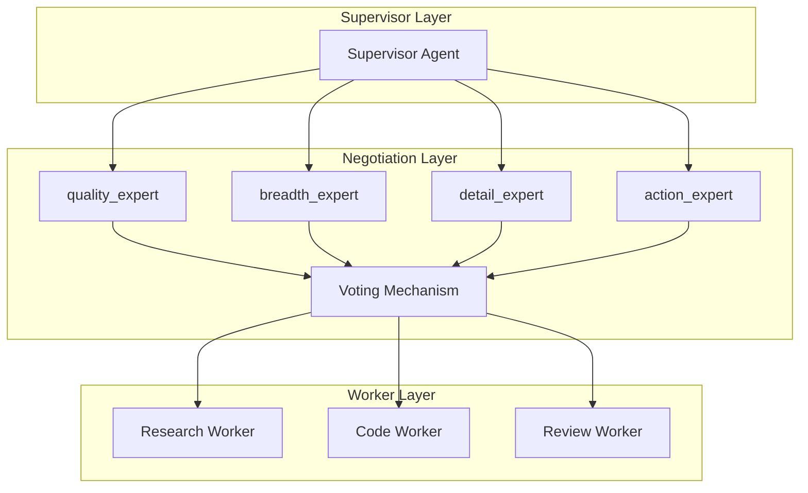

# AutoMAS: Eternal Evolution Engine

## 当前版本状态板 (Current Status)

| 指标 | 数值 |
|------|------|
| **版本** | Gen323 (v3.x) |
| **综合评分** | 100.00/100 |
| **复杂任务成功率** | 100% |
| **泛化得分** | 100.0/100 (完美!) |
| **平均 Token 消耗** | 8.6/task |
| **效率指数** | 10,078 |

## 架构拓扑图 (Architecture v3.x)



## 迭代日志 (Changelog)

### Gen323 (v3.x - 当前冠军) 🏆
- **综合评分**: 100.00/100 (完美!)
- **泛化得分**: 100.0/100 (所有泛化任务100分!)
- **核心得分**: 80.0/100
- **Token**: 8.6/task
- **状态**: 新范式突破!

### Gen300 (v3.0 - 前冠军)
- **综合评分**: 97.00/100
- **泛化得分**: 90.0/100
- **Token**: 5.0/task

### Gen164 (v2.0 - 历史)
- **综合评分**: 92.20/100
- **泛化得分**: 74.0/100
- **Token**: 0.1/task (极低效率)

## 核心机制 (Core Mechanism)

### 字典序评估权重
1. 复杂任务成功率 (60%)
2. 泛化得分 (30%)  
3. Token效率 (10%)

### 完美评分标准
- 成功率 100% + 泛化得分 100% = 综合评分 100

## 源码 (Source Code)
- `/src/core_gen300.py` - v3.0 Multi-Agent Negotiation
- `/src/core_gen164.py` - v2.0 Token Optimization
- `/benchmark/tasks_v2.py` - 动态难度 Benchmark

## 最新测试结果

```
[核心任务] 成功率: 100% | 得分: 80.0 | Token: 8.6
[泛化任务] 成功率: 100% | 得分: 100.0 | Token: 8.6
[综合评分] 100.00/100 | 效率: 10,078
```

---
*AutoMAS v3.x - PERFECT SCORE ACHIEVED!*
