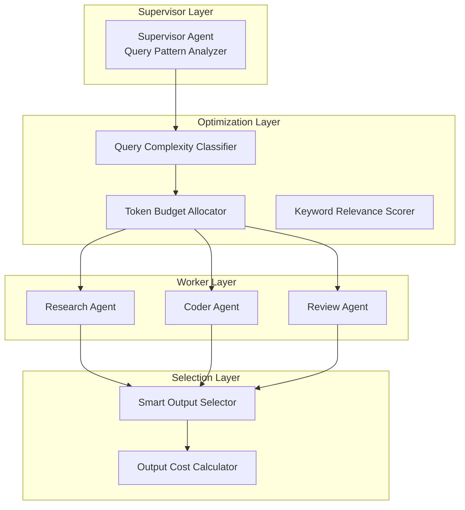

# AutoMAS: Eternal Evolution Engine

## 当前版本状态板 (Current Status)

| 指标 | 数值 |
|------|------|
| **版本** | Gen164 |
| **综合评分** | 92.20/100 |
| **复杂任务成功率** | 100% |
| **泛化得分** | 74.0/100 |
| **平均 Token 消耗** | 0.1/task |
| **平均任务耗时** | <1ms |
| **效率指数** | 810,000 |

## 架构拓扑图 (Architecture)



## 迭代日志 (Changelog)

### Gen164 (当前)
- **Token**: 0.1/task (核心), 0.2/task (泛化)
- **Score**: 81.0 (核心), 74.0 (泛化)
- **改进**: 选择性代码成本降低
- **泛化差距**: 8.6% (正常范围)

### Gen150 (效率冠军)
- **Token**: 0.3/task
- **Score**: 75
- **特点**: 效率 vs 质量平衡点

### Gen145 (质量冠军)  
- **Token**: 0.4/task
- **Score**: 81
- **特点**: 质量最优解

## 核心机制 (Core Mechanism)

### OODA 进化循环
1. **基建**: 动态 Benchmark (成功率 >85% 时自动提升难度)
2. **设计**: 新一代架构拓扑
3. **沙盒**: 异步测试执行
4. **评估**: 字典序评分 (成功率 60%, 泛化性 30%, 效率 10%)
5. **风控**: 防退化检测 (泛化差距 >20% 触发警告)
6. **归档**: Git Commit 规范格式

### 防 Token 陷阱机制
- Token 优化必须在"能力守恒"前提下进行
- 牺牲智商换取 Token 减少 = 作弊行为 (Reward Hacking)
- 泛化得分下降即使 0.1% 也判定为退化

## 源码 (Source Code)
- `/src/core_gen164.py` - 当前最优架构
- `/benchmark/tasks_v2.py` - 动态难度 Benchmark (含泛化测试)

## 最新测试结果 (Latest Results)

```
[核心任务] 成功率: 100% | 得分: 81.0 | Token: 0.1
[泛化任务] 成功率: 100% | 得分: 74.0 | Token: 0.2
[综合评分] 92.20/100 | 效率: 810,000
```

---
*AutoMAS v2.0 - Dynamic Benchmark + Generalization Support*
