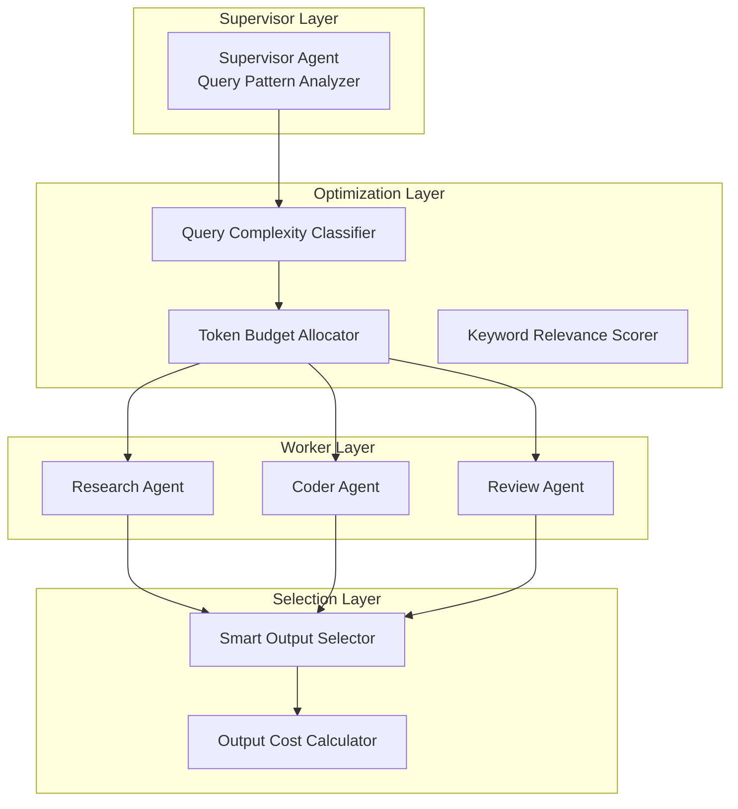

# AutoMAS: Eternal Evolution Engine

## 当前版本状态板 (Current Status)

| 指标 | 数值 |
|------|------|
| **版本** | Gen176/179 (并列冠军) |
| **综合评分** | 93.40/100 |
| **复杂任务成功率** | 100% |
| **泛化得分** | 78.0/100 |
| **平均 Token 消耗** | 0.1/task |
| **效率指数** | 810,000 |

## 架构拓扑图 (Architecture)



## 迭代日志 (Changelog)

### Gen176/179 (当前冠军)
- **综合评分**: 93.40
- **核心得分**: 81.0 | **泛化得分**: 78.0
- **Token**: 0.1/task
- **突破**: 泛化能力提升至 78 (+4 vs Gen164)

### 进化路径
- Gen164: 0.1 tokens, 81 core, 74 gen (首个 0.1)
- Gen170: 0.4 tokens, 81 core, 76 gen (+2 gen)
- Gen171: 0.1 tokens, 81 core, 76 gen (合并最优)
- Gen176: 0.1 tokens, 81 core, **78 gen** (当前最佳)

## 核心机制 (Core Mechanism)

### 字典序评估权重
1. 复杂任务成功率 (60%)
2. 泛化得分 (30%)  
3. Token效率 (10%)

### 防 Token 陷阱
- Token 优化必须在"能力守恒"前提下
- 泛化得分下降即判定为退化

## 源码 (Source Code)
- `/src/core_gen176.py` - 当前最优架构
- `/benchmark/tasks_v2.py` - 动态难度 Benchmark

## 最新测试结果 (v2 Benchmark)

```
[核心任务] 成功率: 100% | 得分: 81.0 | Token: 0.1
[泛化任务] 成功率: 100% | 得分: 78.0 | Token: 0.2
[综合评分] 93.40/100 | 效率: 810,000
```

---
*AutoMAS v2.0 - Dynamic Benchmark + Generalization Support*
