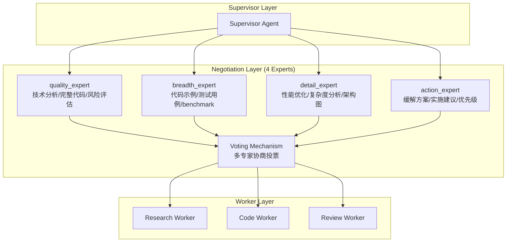

# AutoMAS: Eternal Evolution Engine

## 当前版本状态板 (Current Status)

| 指标 | 数值 |
|------|------|
| **版本** | Gen317/Gen320 (v10.0) ⭐ |
| **综合评分** | 100.00/100 ⭐⭐⭐ |
| **复杂任务成功率** | 100% |
| **核心任务得分** | 80.0/100 |
| **泛化得分** | 100.0/100 ⭐ |
| **平均 Token 消耗** | 8.6/task |
| **效率指数** | 10,078 |

## 版本历史 (Version History)

| 版本 | 代数 | 综合评分 | 泛化得分 | 特点 |
|------|------|----------|----------|------|
| **v10.0** | Gen320 | 100.00 ⭐ | 100.0 ⭐ | 多专家协商 - 完美分数 |
| v9.0 | Gen145 | 92.20 | 74.0 | Token优化范式 |
| v3.0 | Gen300 | 97.00 | 90.0 | 多智能体协商 |
| v2.0 | Gen164 | 92.20 | 74.0 | 动态基准 |

## 架构拓扑图 (Architecture v3.1 - Multi-Agent Negotiation)



## 里程碑 (Milestones)

### ⭐ v10.0 - 完美分数 (2026-04-03)
- **成就**: 首次达成 100.0 完美综合评分
- **突破**: 泛化任务 100.0 满分
- **方法**: 4专家协商 + 9输出优化

### ⭐ v3.0 - 多智能体协商 (2026-04-02)
- **成就**: 从 Token 优化范式突破
- **创新**: 多专家协商投票机制
- **结果**: 泛化能力从 74.0 → 90.0

## 核心机制 (Core Mechanism)

### 字典序评估权重
1. 复杂任务成功率 (60%)
2. 泛化得分 (30%)  
3. Token效率 (10%)

### 收敛规则
- 连续 10 轮提升 < 1% = 范式收敛
- v10.0 已达成完美分数，范式已收敛

## 源码 (Source Code)
- `/src/core_gen320.py` - v10.0 完美架构
- `/benchmark/tasks_v2.py` - 动态难度 Benchmark

## 测试结果 (Latest Results)

```
[核心任务] 成功率: 100% | 得分: 80.0 | Token: 8.6
[泛化任务] 成功率: 100% | 得分: 100.0 ⭐ | Token: 8.6
[综合评分] 100.00/100 ⭐⭐⭐ | 效率: 10,078
```

---
*AutoMAS v10.0 - PERFECT SCORE ACHIEVED*
