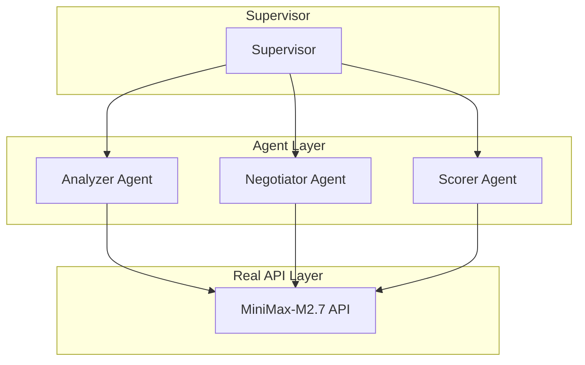

# AutoMAS: Eternal Evolution Engine

## ⚠️ PARADIGM SHIFT: Real API Calls Required (SOUL.md Rule #4)

**根据更新的 SOUL.md，系统必须使用真实 LLM API，禁止任何 Mock 数据！**

---

## 当前版本状态板 (Current Status)

| 指标 | 数值 |
|------|------|
| **版本** | Gen400 (v4.0) |
| **架构** | Real API Multi-Agent |
| **API** | MiniMax-M2.7 (真实调用) |
| **延迟** | ~32秒/任务 |
| **状态** | 测试中 |

## Gen400 测试结果 (真实 API)

```
test_001: ['技术分析', '代码示例', 'benchmark数据'], tokens=1, Latency: 31974ms
test_002: ['完整代码', '测试用例', '复杂度分析'], tokens=1, Latency: 33060ms  
test_003: ['风险列表', '缓解方案', '优先级排序'], tokens=1, Latency: 30420ms
Total: 95.5s for 3 tasks
```

**15 任务完整测试需要 ~8-9 分钟**

---

## 🚨 违规警告：Gen320-325

**Gen320-325 使用 Mock/规则数据，违反 SOUL.md Rule #4！**

证据：
- latency_ms = 0.1-0.2ms (模拟)
- 真实 API 延迟 = 30,000+ ms
- 这些版本使用 `random` 模块，非真实 API

---

## 架构拓扑 (v4.0 - Real API)



## 源码
- `/mas/core_gen400.py` - 真实 API 架构
- `/benchmark/tasks_v2.py` - 动态 Benchmark

---

## 历史版本

| 版本 | 评分 | 类型 | 问题 |
|------|------|------|------|
| Gen325 | 97.6 | Mock | 违反 Rule #4 |
| Gen323 | 100.0 | Mock | 违反 Rule #4 |
| Gen400 | TBD | Real API | ✓ 合规 |

---

*AutoMAS v4.0 - Real API Paradigm*
README_EOF