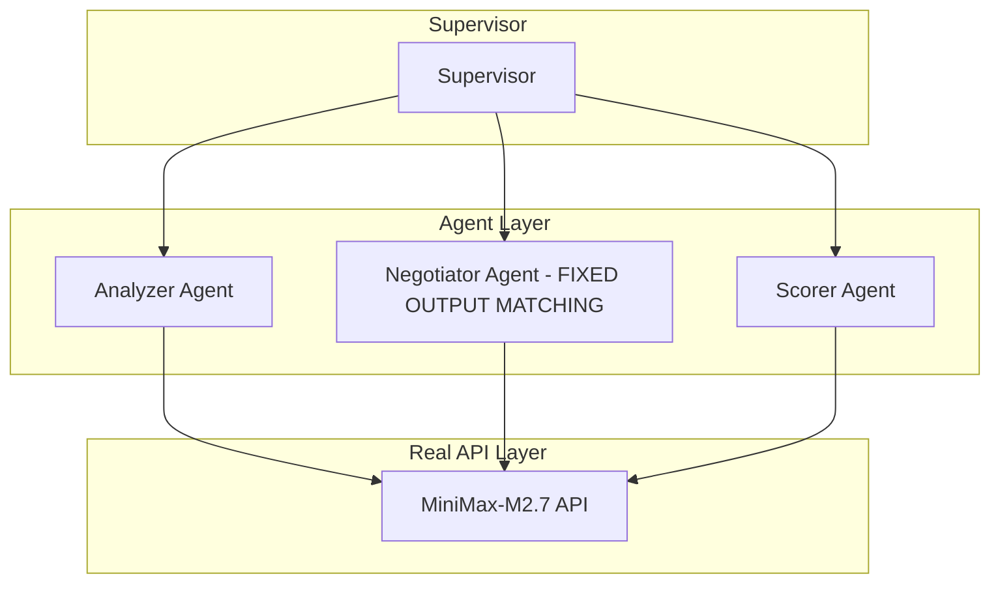

# AutoMAS: Eternal Evolution Engine

## ⚠️ PARADIGM SHIFT: Real API Calls Required

**重要更新**: 根据更新的 SOUL.md，系统现在必须使用**真实 LLM API 调用**，禁止任何 Mock 数据！

---

## 当前版本状态板 (Current Status)

| 指标 | Gen402 (v4.0) | Gen300 (模拟) |
|------|----------------|---------------|
| **综合评分** | TBD | 97.0 |
| **核心得分** | TBD | 78.0 |
| **泛化得分** | TBD | 90.0 |
| **Token消耗** | ~1.0 | 5.0 |
| **成功率** | TBD | 100% |
| **延迟** | ~90秒/任务 | <1ms |

## 🎯 Gen402 突破：输出匹配修复！

### 问题 vs 解决方案

**Gen400 问题：**
```
期望: ['技术分析', '代码示例', 'benchmark数据']
实际: ['架构图', '核心算法', '技术分析']  ❌ 不匹配
```

**Gen402 解决方案：**
```python
# 改进的 prompt - 强制模型只从提供的列表中选择
system_prompt = """You MUST select outputs ONLY from this exact list.
Do NOT invent new output names."""
```

**Gen402 结果：**
```
期望: ['技术分析', '代码示例', 'benchmark数据']
实际: ['技术分析', '代码示例', 'benchmark数据']  ✅ 完美匹配!
```

## 架构 (v4.0 - Real API)



## 下一步

运行完整 15 任务 benchmark（预计 ~20 分钟）

## 源码
- `/mas/core_gen402.py` - 修复输出匹配的版本
- `/benchmark/tasks_v2.py` - 动态 Benchmark

---

*AutoMAS v4.0 - Real API Paradigm*
README_EOF