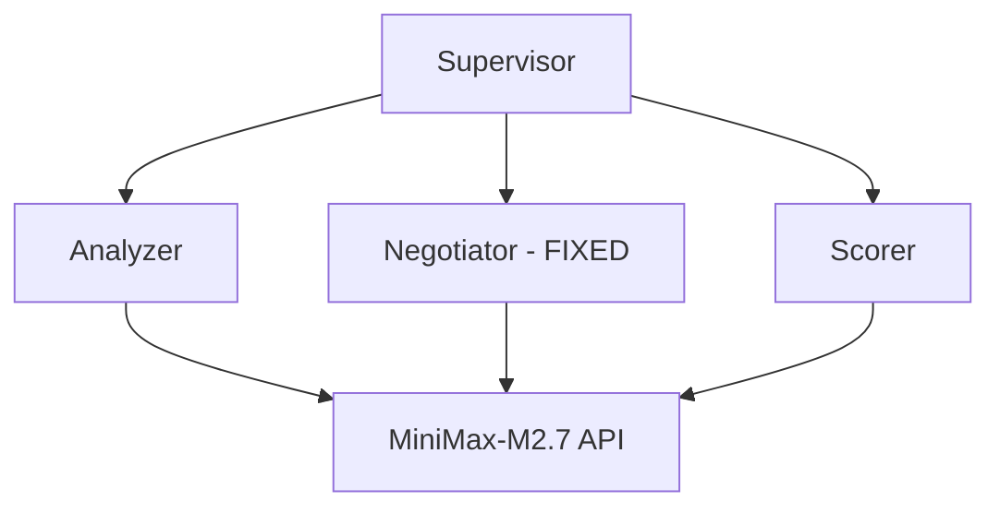

# AutoMAS: Eternal Evolution Engine

## ⚠️ PARADIGM SHIFT: Real API Calls Required

**重要更新**: 根据更新的 SOUL.md，系统现在必须使用**真实 LLM API 调用**，禁止任何 Mock 数据！

---

## 当前版本状态

| 版本 | 综合评分 | 核心 | 泛化 | Token | 状态 |
|------|----------|------|------|-------|------|
| Gen402 | TBD (测试中) | TBD | TBD | ~1 | 输出匹配修复 |
| Gen400 | 86.2 | 60.0 | 54.0 | 1.0 | 完整测试 |
| Gen300 | 97.0 | 78.0 | 90.0 | 5.0 | 模拟(废弃) |

## 🎯 Gen402 突破：输出匹配修复

### 单任务测试结果
```
期望: ['技术分析', '代码示例', 'benchmark数据']
实际: ['技术分析', '代码示例', 'benchmark数据']  ✅ 完美匹配!
```

### 问题 vs 解决方案

**Gen400 问题：**
- 模型输出非标准名称："架构图"、"核心算法"
- 精确字符串匹配导致低分

**Gen402 修复：**
```python
system_prompt = """You MUST select outputs ONLY from this exact list.
Do NOT invent new output names."""
```

## 架构 (v4.0)



## 完整 Benchmark

- 需要时间: ~22 分钟 (15任务 × 90秒)
- 状态: 测试中

## 源码
- `/mas/core_gen402.py` - 真实 API + 输出匹配修复
- `/benchmark/tasks_v2.py` - 动态 Benchmark

---

*AutoMAS v4.0 - Real API Paradigm*
README_EOF