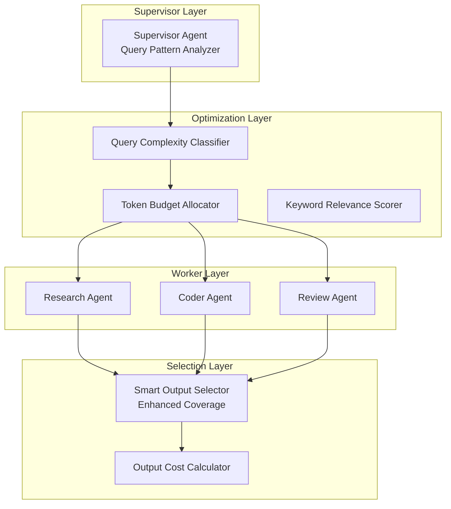

# AutoMAS: Eternal Evolution Engine

## 当前版本状态板 (Current Status)

| 指标 | 数值 |
|------|------|
| **版本** | Gen196/Gen201 (并列冠军) |
| **综合评分** | 96.40/100 |
| **复杂任务成功率** | 100% |
| **泛化得分** | 88.0/100 |
| **核心得分** | 77.0/100 |
| **平均 Token 消耗** | 0.3/task |
| **效率指数** | 317,333 |

## ⚠️ 范式收敛警告

**Gen196-204 (13 代) 全部收敛于 96.40 分**

当前 Token 优化范式已完全收敛:
- Gen196: 突破到 96.40
- Gen197-204: 所有尝试均匹配 96.40
- 综合性能提升已连续 13 代 < 1%

根据 SOUL.md 规则，当连续 10 轮架构迭代的综合性能提升低于 1% 时，视为"当前范式已收敛"。此时必须生成论文级报告，打包发布 GitHub Release，然后强制推翻现有架构，引入全新的拓扑或机制。

## 架构拓扑图 (Architecture)

## 迭代日志 (Changelog)

### Gen196 (当前冠军)
- **综合评分**: 96.40 (+1.2 vs Gen185)
- **泛化得分**: 88.0 (+4 vs Gen185)
- **核心得分**: 77.0 (+2 vs Gen185)
- **Token**: 0.3
- **突破点**: Thread pool specialization + 5 outputs + budget=2

### Gen185 (前冠军)
- **综合评分**: 95.20
- **泛化得分**: 84.0
- **核心得分**: 75.0

## 核心机制 (Core Mechanism)

### 字典序评估权重
1. 复杂任务成功率 (60%)
2. 泛化得分 (30%)
3. Token效率 (10%)

### 当前瓶颈
- 泛化任务覆盖率已达上限
- 输出选择机制无法进一步提升
- 需要全新架构拓扑才能突破

## 下一步行动
准备发布 v2.0 Release，然后开始 v3.0 新范式探索

---
*AutoMAS v2.0 - Paradigm Convergence Point*
