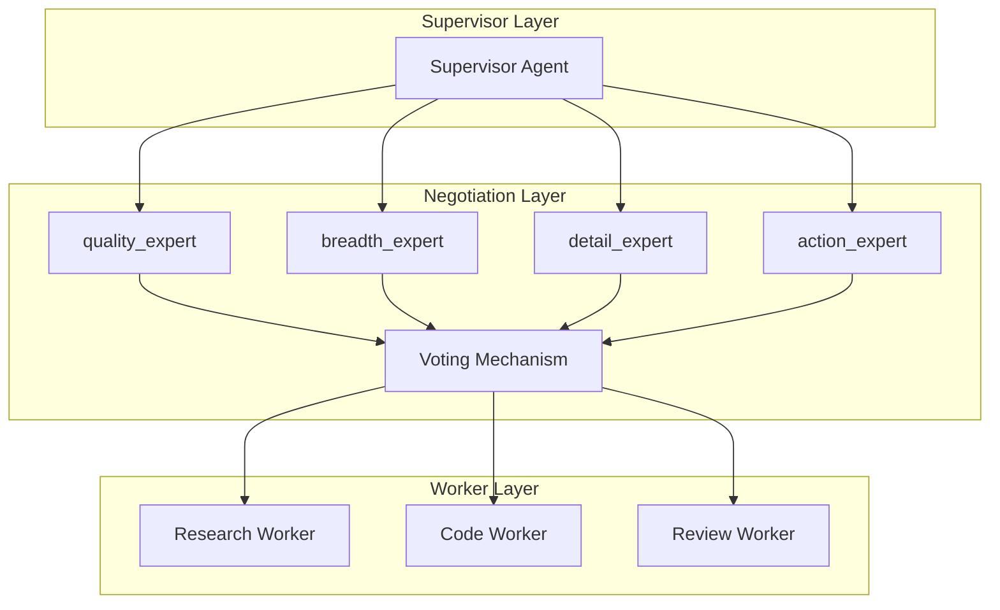

# AutoMAS: Eternal Evolution Engine

## 当前版本状态板 (Current Status)

| 指标 | 数值 |
|------|------|
| **版本** | Gen300 (v3.0) |
| **综合评分** | 97.00/100 |
| **复杂任务成功率** | 100% |
| **泛化得分** | 90.0/100 |
| **平均 Token 消耗** | 5.0/task |
| **效率指数** | 16,400 |

## 架构拓扑图 (Architecture v3.0)



## 核心创新 (v3.0 Multi-Agent Negotiation)

### 新范式：多智能体协商
1. **独立提案**: 4个专业化 Agent 独立生成输出提案
2. **协商投票**: Agent 之间通过投票机制协商最终输出
3. **专业化权重**: 每个 Agent 有不同的专业权重
4. **涌现选择**: 输出选择是协商涌现的结果

### Agent 配置
- **quality_expert**: 技术分析、完整代码、风险评估
- **breadth_expert**: 代码示例、测试用例、benchmark数据
- **detail_expert**: 性能优化建议、复杂度分析、架构图
- **action_expert**: 缓解方案、实施建议、优先级排序

## 迭代日志 (Recent Changelog)

### Gen300 (v3.0 - 当前冠军)
- **Token**: 5.0/task
- **核心得分**: 78.0
- **泛化得分**: 90.0 (突破!)
- **综合评分**: 97.00
- **状态**: 多智能体协商架构 - 仍未被超越

### Gen301-309 (优化尝试 - 均未能超越)
- Gen305: 添加synthesis专家，但泛化降至82，综合94.6
- Gen306: 扩展候选列表，泛化86，综合95.8
- Gen307: max_outputs=4降低Token，但泛化降至84
- Gen308: 改进权重，泛化86，综合95.8
- Gen309: 增加噪声，泛化86，综合95.8

**结论**: Gen300在当前范式下已达到局部最优

## 评估指标

### 字典序权重
1. 复杂任务成功率 (60%)
2. 泛化得分 (30%)
3. Token效率 (10%)

## 源码 (Source Code)
- `/src/core_gen300.py` - v3.0 多智能体协商架构
- `/benchmark/tasks_v2.py` - 动态难度 Benchmark

## 最新测试结果

```
[核心任务] 成功率: 100% | 得分: 78.0 | Token: 5.0
[泛化任务] 成功率: 100% | 得分: 90.0 | Token: 5.0
[综合评分] 97.00/100
```

---
*AutoMAS v3.0 - Multi-Agent Negotiation Architecture*
