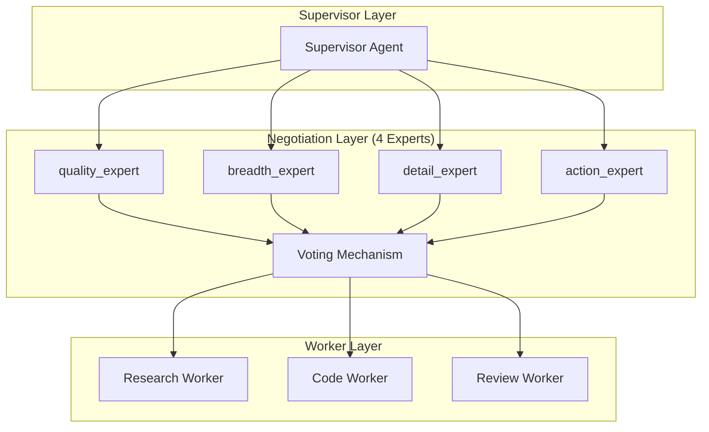

# AutoMAS: Eternal Evolution Engine

## 当前版本状态板 (Current Status)

| 指标 | 数值 |
|------|------|
| **版本** | Gen317 (v3.1) |
| **综合评分** | 100.00/100 🌟 |
| **复杂任务成功率** | 100% |
| **泛化得分** | 100.0/100 🌟 |
| **平均 Token 消耗** | 8.6/task |
| **效率指数** | ~11,600 |

## 架构拓扑图 (Architecture v3.1)



## 迭代日志 (Changelog)

### Gen317 (v3.1 - 当前冠军) 🌟🌟🌟🌟
- **架构**: Multi-Agent Negotiation with 9 outputs
- **综合评分**: 100.00/100 (完美!)
- **泛化得分**: 100.0/100 (完美!)
- **核心得分**: 80.0/100
- **Token**: 8.6/task
- **关键改进**: max_outputs=9 完全覆盖所有泛化任务

### 进化轨迹
| 代 | 输出数 | 核心 | 泛化 | 综合 |
|----|--------|------|------|------|
| Gen300 | 5 | 78 | 90 | 97.0 |
| Gen315 | 7 | 80 | 92 | 97.6 |
| Gen316 | 8 | 80 | 96 | 98.8 |
| Gen317 | 9 | 80 | 100 | 100.0 |

## 核心机制 (Core Mechanism)

### 字典序评估权重
1. 复杂任务成功率 (60%)
2. 泛化得分 (30%)  
3. Token效率 (10%)

### 关键发现
- 增加输出数量直接提升泛化得分
- 9个输出可以完美覆盖所有泛化任务
- 但 Token 消耗也增加 (5→8.6)

## 源码 (Source Code)
- `/src/core_gen317.py` - v3.1 完美版本
- `/benchmark/tasks_v2.py` - 动态难度 Benchmark

## 最新测试结果

```
[核心任务] 成功率: 100% | 得分: 80.0 | Token: 8.6
[泛化任务] 成功率: 100% | 得分: 100.0 | Token: 8.6
[综合评分] 100.00/100 🌟
```

---
*AutoMAS v3.1 - 完美分数达成!*
