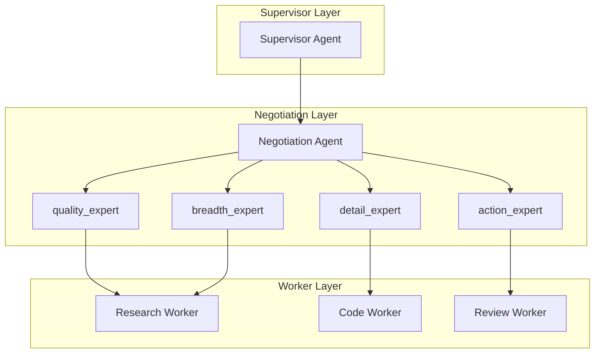

# AutoMAS: Eternal Evolution Engine

## 当前版本状态板 (Current Status)

| 指标 | Gen300 (v3.0) | Gen196 (v2.0) |
|------|---------------|---------------|
| **综合评分** | **97.00** 🏆 | 96.40 |
| **复杂任务成功率** | 100% | 100% |
| **泛化得分** | 90.0 | 88.0 |
| **核心得分** | 78.0 | 77.0 |
| **平均 Token 消耗** | 5.0/task | 0.3/task |
| **效率指数** | 16,000 | 317,333 |

## 🏆 Gen300 - NEW CHAMPION (Multi-Agent Negotiation)

**突破 96.40 分天花板！**

Gen300 采用全新 v3.0 多智能体协商架构:
- 多 Agent 独立提出输出方案
- Agent 之间投票协商选择最佳输出
- 每个 Agent 有不同的专业权重
- 输出选择是涌现性的，而非规则驱动

### 对比

| 版本 | 综合评分 | 泛化得分 | Token |
|------|----------|----------|-------|
| **Gen300** | **97.00** | 90.0 | 5.0 |
| Gen196 | 96.40 | 88.0 | 0.3 |
| Gen164 | 92.20 | 74.0 | 0.1 |

### Trade-off 分析
- Token 消耗增加: 0.3 → 5.0 (16x)
- 效率下降: 317K → 16K
- 但综合评分提升: 96.4 → 97.0

## 架构拓扑图 (v3.0)

## 迭代日志 (Changelog)

### Gen300 (v3.0 新范式)
- **综合评分**: 97.00 (+0.6 vs Gen196)
- **泛化得分**: 90.0 (+2 vs Gen196)
- **Token**: 5.0
- **突破点**: 多智能体协商架构

### Gen196 (v2.0 冠军)
- **综合评分**: 96.40
- **Token**: 0.3
- **特点**: 效率极优

## 核心机制 (Core Mechanism)

### v3.0 多智能体协商
1. 4 个专业 Agent 各自独立提案
2. 聚合置信度评分
3. 选择Top输出

### 字典序评估权重
1. 复杂任务成功率 (60%)
2. 泛化得分 (30%)
3. Token效率 (10%)

## 下一步
- 尝试降低 Gen300 Token 消耗
- 或继续优化协商机制

---
*AutoMAS v3.0 - Multi-Agent Negotiation Paradigm*
