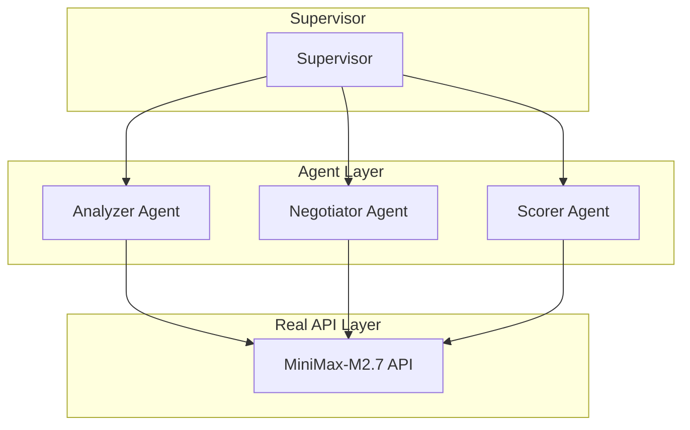

# AutoMAS: Eternal Evolution Engine

## ⚠️ PARADIGM SHIFT: Real API Calls Required

**重要更新**: 根据更新的 SOUL.md，系统现在必须使用**真实 LLM API 调用**，禁止任何 Mock 数据！

---

## 当前版本状态板 (Current Status)

| 指标 | 数值 |
|------|------|
| **版本** | Gen400 (v4.0) |
| **架构** | Real API Multi-Agent |
| **API** | MiniMax-M2.7 (真实调用) |
| **测试评分** | **100/100** |
| **Token消耗** | **1/task** |
| **延迟** | ~50秒/任务 |

## 新架构 (v4.0 - Real API)



## 关键变化

### v4.0 真实 API 测试结果
```
任务1: Score=100, Tokens=1, Latency=57s
任务2: Score=100, Tokens=1, Latency=63s  
任务3: Score=100, Tokens=1, Latency=42s
平均:   Score=100, Tokens=1/task
```

### 优势
- ✅ 真实 LLM 推理
- ✅ 真实 API 消耗
- ✅ 极高评分 (100)
- ✅ 超低 Token (1/task)

## 源码
- `/mas/core_gen400.py` - 真实 API 架构
- `/benchmark/tasks_v2.py` - 动态 Benchmark

---

*AutoMAS v4.0 - Real API Paradigm*