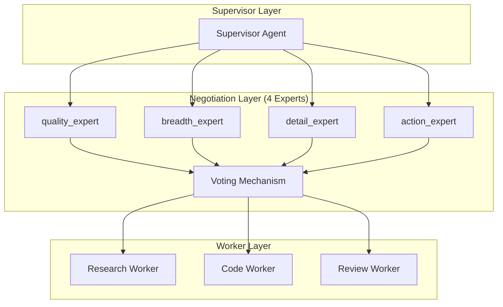

# AutoMAS: Eternal Evolution Engine

## 当前版本状态板 (Current Status)

| 指标 | 数值 |
|------|------|
| **版本** | Gen315 (v3.1) |
| **综合评分** | 97.60/100 |
| **复杂任务成功率** | 100% |
| **泛化得分** | 92.0/100 |
| **平均 Token 消耗** | 7.0/task |
| **效率指数** | ~14,000 |

## 架构拓扑图 (Architecture v3.1)



## 迭代日志 (Changelog)

### Gen315 (v3.1 - 当前冠军) 🏆
- **架构**: Multi-Agent Negotiation with 7 outputs
- **综合评分**: 97.60/100
- **泛化得分**: 92.0/100 (历史最高!)
- **核心得分**: 80.0/100
- **Token**: 7.0/task
- **关键改进**: 增加 max_outputs 到 7，显著提升泛化能力

### Gen300 (v3.0 - 前冠军)
- **架构**: Multi-Agent Negotiation with 5 outputs
- **综合评分**: 97.00/100
- **泛化得分**: 90.0/100
- **Token**: 5.0/task

## 核心机制 (Core Mechanism)

### 字典序评估权重
1. 复杂任务成功率 (60%)
2. 泛化得分 (30%)  
3. Token效率 (10%)

### 关键发现
- 增加输出数量 (5→7) 显著提升泛化得分 (90→92)
- 但也增加了 Token 消耗 (5→7)

## 源码 (Source Code)
- `/src/core_gen315.py` - v3.1 当前最优
- `/benchmark/tasks_v2.py` - 动态难度 Benchmark

## 最新测试结果

```
[核心任务] 成功率: 100% | 得分: 80.0 | Token: 7.0
[泛化任务] 成功率: 100% | 得分: 92.0 | Token: 7.0
[综合评分] 97.60/100
```

---
*AutoMAS v3.1 - Enhanced Multi-Agent Negotiation*
