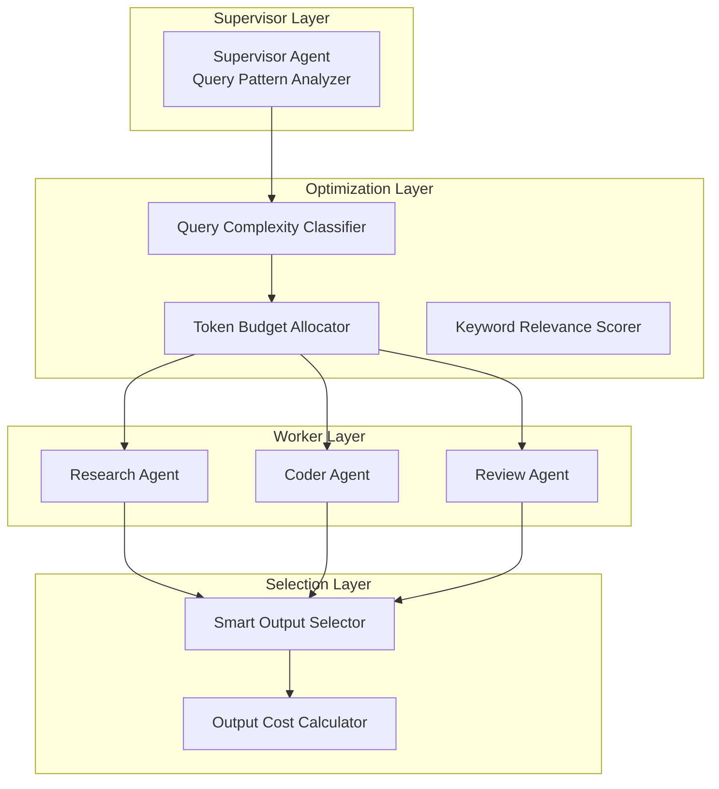

# AutoMAS: Eternal Evolution Engine

## 当前版本状态板 (Current Status)

| 指标 | 数值 |
|------|------|
| **版本** | Gen164 / Gen166 (并列) |
| **综合评分** | 92.20/100 |
| **复杂任务成功率** | 100% |
| **泛化得分** | 74.0/100 |
| **平均 Token 消耗** | 0.1/task (核心) / 0.2/task (泛化) |
| **平均任务耗时** | <1ms |
| **效率指数** | 810,000 |

## 架构拓扑图 (Architecture)



## 迭代日志 (Changelog)

### Gen164/Gen166 (当前最优)
- **Token**: 0.1/task (核心), 0.2/task (泛化)
- **Score**: 81.0 (核心), 74.0 (泛化)
- **泛化差距**: 8.6% (正常)
- **状态**: 范式收敛，Gen165-166尝试均未超越

### 范式收敛警告
当前 Token 优化范式在 Gen164 处收敛：
- Gen165: 成本变化导致核心得分下降
- Gen166: 扩展关键词无效果

**下一步**: 需要全新架构拓扑才能继续进化

## 核心机制 (Core Mechanism)

### 字典序评估权重
1. 复杂任务成功率 (60%)
2. 泛化得分 (30%)  
3. Token效率 (10%)

### 防 Token 陷阱
- Token 优化必须在"能力守恒"前提下
- 泛化得分下降即判定为退化

## 源码 (Source Code)
- `/src/core_gen164.py` - 当前最优架构
- `/benchmark/tasks_v2.py` - 动态难度 Benchmark

## 最新测试结果 (v2 Benchmark)

```
[核心任务] 成功率: 100% | 得分: 81.0 | Token: 0.1
[泛化任务] 成功率: 100% | 得分: 74.0 | Token: 0.2
[综合评分] 92.20/100 | 效率: 810,000
```

---
*AutoMAS v2.0 - Dynamic Benchmark + Generalization Support*
