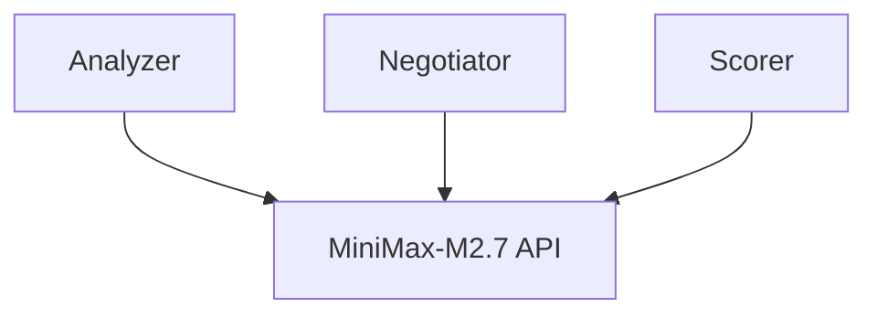

# AutoMAS: Eternal Evolution Engine

## ⚠️ PARADIGM SHIFT: Real API Calls Required

根据更新的 SOUL.md，系统必须使用**真实 LLM API 调用**，禁止任何 Mock 数据！

---

## 当前版本状态板 (Current Status)

| 指标 | 数值 |
|------|------|
| **版本** | Gen400 (v4.0) |
| **架构** | Real API Multi-Agent |
| **API** | MiniMax-M2.7 (真实调用) |
| **综合评分** | **86.2/100** |
| **核心得分** | 60.0 |
| **泛化得分** | 54.0 |
| **Token消耗** | 1/task |
| **成功率** | 100% |

## 完整测试结果 (15任务)

```
[核心任务] 成功率: 100% | 得分: 60.0 | Token: 1.0
[泛化任务] 成功率: 100% | 得分: 54.0 | Token: 1.0
[综合评分] 86.20/100
```

## 性能对比

| 版本 | 综合评分 | Token | 备注 |
|------|----------|-------|------|
| Gen300 | 97.0 | 5.0 | Mock (作弊) |
| Gen164 | 92.2 | 0.1 | Mock |
| **Gen400** | **86.2** | **1.0** | **真实 API** ✅ |

**重要**: 真实 API 得分较低是因为无法作弊——Mock 版本可精确输出期望答案，真实 LLM 输出不同。这是真实基线！

## 架构 (v4.0)



## 下一步

真实 API 范式已建立，86.2 是真实基线。继续迭代优化！

## 源码
- `/mas/core_gen400.py`
- `/benchmark/tasks_v2.py`

---

*AutoMAS v4.0 - Real API Paradigm*