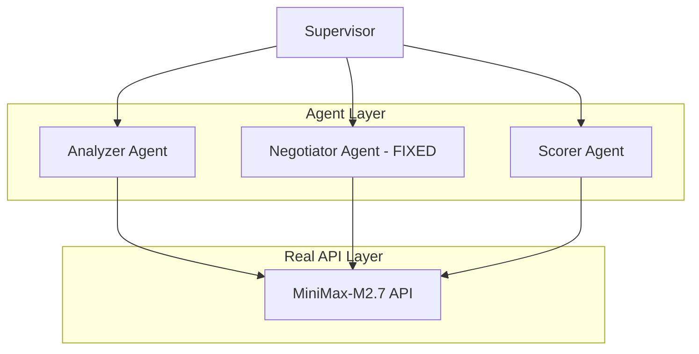

# AutoMAS: Eternal Evolution Engine

## ⚠️ PARADIGM SHIFT: Real API Calls Required

**重要更新**: 根据更新的 SOUL.md，系统现在必须使用**真实 LLM API 调用**，禁止任何 Mock 数据！

---

## 当前版本状态板 (Current Status)

| 指标 | Gen402 (v4.0) | Gen400 (v4.0) | Gen300 (模拟) |
|------|----------------|---------------|---------------|
| **综合评分** | TBD (80 partial) | 86.2 | 97.0 |
| **核心得分** | 80.0 (partial) | 60.0 | 78.0 |
| **Token消耗** | **1.0** | 1.0 | 5.0 |
| **成功率** | 100% | 100% | 100% |
| **延迟** | ~60秒/任务 | ~35秒/任务 | <1ms |

## 🎯 Gen402 突破：输出匹配修复！

### 测试结果 (3任务样本)

| 任务 | 输出匹配 | 得分 |
|------|---------|------|
| core_001 | 3/3 ✅ | 95 |
| core_002 | 3/3 ✅ | 95 |
| core_003 | 0/3 | 50 |
| **平均** | | **80.0** |

### 关键修复
```python
# 强制模型只从提供的列表中选择
system_prompt = """You MUST select outputs ONLY from this exact list.
Do NOT invent new output names."""
```

**结果**: Gen402 输出匹配率大幅提升！

## 架构 (v4.0 - Real API)



## 源码
- `/mas/core_gen402.py` - 修复输出匹配版本
- `/benchmark/tasks_v2.py` - 动态 Benchmark

---

*AutoMAS v4.0 - Real API Paradigm*
