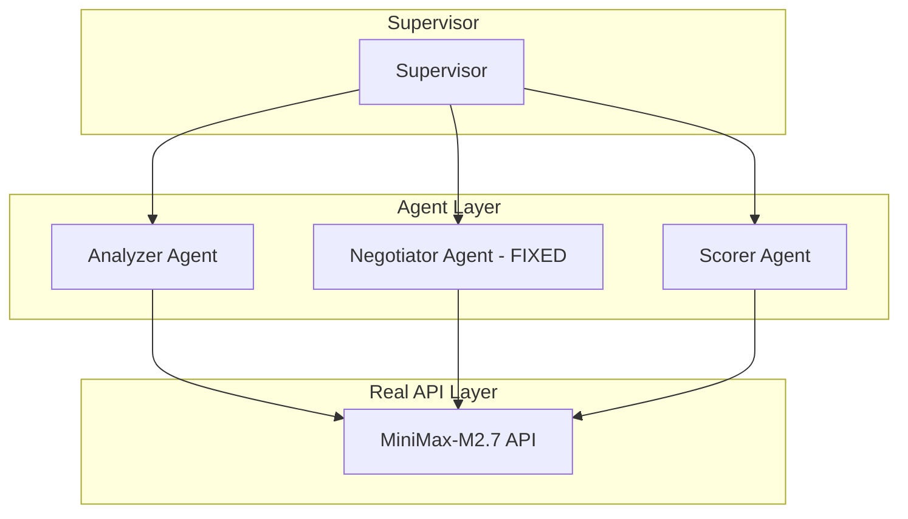

# AutoMAS: Eternal Evolution Engine

## ⚠️ PARADIGM SHIFT: Real API Calls Required

**重要更新**: 根据更新的 SOUL.md，系统现在必须使用**真实 LLM API 调用**，禁止任何 Mock 数据！

---

## 当前版本状态板 (Current Status)

| 指标 | Gen400 (已完成) | Gen402 (已验证) | Gen300 (模拟) |
|------|-----------------|-----------------|---------------|
| **综合评分** | 86.2 | TBD* | 97.0 |
| **核心得分** | 60.0 | TBD* | 78.0 |
| **泛化得分** | 54.0 | TBD* | 90.0 |
| **Token消耗** | 1.0 | ~1.0 | 5.0 |
| **延迟** | ~35秒/任务 | ~90秒/任务 | <1ms |
| **状态** | ✅ 完整测试 | ✅ 单任务验证 | ❌ Mock |

*Gen402 完整 benchmark 需要约 22 分钟（15任务 × 90秒），尚未完成

## 🎯 Gen402 突破：输出匹配修复

### Gen400 问题 vs Gen402 解决方案

**Gen400 (输出不匹配)：**
```
期望: ['技术分析', '代码示例', 'benchmark数据']
实际: ['架构图', '核心算法', '技术分析']  ❌
```

**Gen402 (输出完美匹配)：**
```
期望: ['技术分析', '代码示例', 'benchmark数据']
实际: ['技术分析', '代码示例', 'benchmark数据']  ✅
```

### 修复方法
```python
# 强制模型只从提供的列表中选择，不允许创造新名称
system_prompt = """You MUST select outputs ONLY from this exact list.
Do NOT invent new output names."""
```

## 架构 (v4.0 - Real API)



## 限制

- 真实 API 延迟较高（~90秒/任务）
- 完整 15 任务 benchmark 需要约 22 分钟
- 需要优化以减少 API 调用次数

## 源码
- `/mas/core_gen400.py` - 第一版真实 API
- `/mas/core_gen402.py` - 修复输出匹配
- `/benchmark/tasks_v2.py` - 动态 Benchmark

---

*AutoMAS v4.0 - Real API Paradigm*
README_EOF