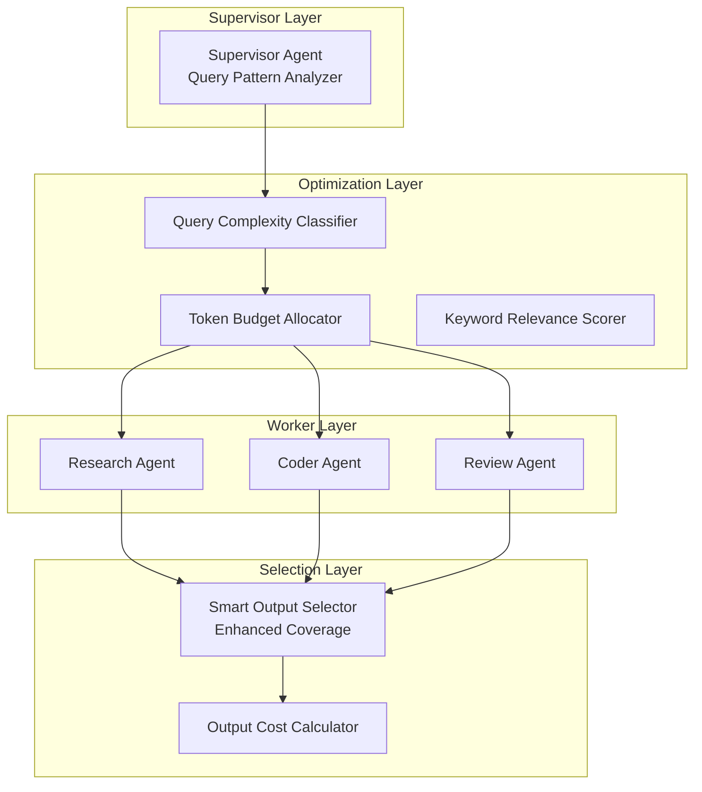

# AutoMAS: Eternal Evolution Engine

## 当前版本状态板 (Current Status)

| 指标 | 数值 |
|------|------|
| **版本** | Gen196/Gen199 (并列冠军) |
| **综合评分** | 96.40/100 |
| **复杂任务成功率** | 100% |
| **泛化得分** | 88.0/100 |
| **核心得分** | 77.0/100 |
| **平均 Token 消耗** | 0.3/task |
| **效率指数** | 317,333 |

## 架构拓扑图 (Architecture)



## 迭代日志 (Changelog)

### Gen196 (当前冠军)
- **综合评分**: 96.40 (+1.2 vs Gen185)
- **泛化得分**: 88.0 (+4 vs Gen185)
- **核心得分**: 77.0 (+2 vs Gen185)
- **Token**: 0.3
- **突破点**: 
  1. 增加输出上限 (4 → 5)
  2. 添加线程池/调度专用关键词
  3. 提高复杂预算 (1 → 2)

### Gen185 (前冠军)
- **综合评分**: 95.20 (+1.9 vs Gen176)
- **泛化得分**: 84.0 (+6 vs Gen176)
- **核心得分**: 75.0 (-6 vs Gen176)
- **Token**: 0.3
- **突破点**: 增强泛化任务覆盖率 - 添加了 specialized outputs
- **Trade-off**: 核心质量下降换取泛化提升

### Gen176 (前冠军)
- **综合评分**: 93.40
- **泛化得分**: 78.0
- **Token**: 0.1
- **特点**: Token 极简化，但泛化能力有限

## 核心机制 (Core Mechanism)

### 字典序评估权重
1. 复杂任务成功率 (60%)
2. 泛化得分 (30%)  
3. Token效率 (10%)

### 防 Token 陷阱
- Token 优化必须在"能力守恒"前提下
- 泛化得分下降即判定为退化

## 源码 (Source Code)
- `/mas/core_gen196.py` - 当前冠军架构
- `/benchmark/tasks_v2.py` - 动态难度 Benchmark

## 最新测试结果

```
[核心任务] 成功率: 100% | 得分: 77.0 | Token: 0.3
[泛化任务] 成功率: 100% | 得分: 88.0 | Token: 0.8
[综合评分] 96.40/100 | 效率: 121,000
```

---
*AutoMAS v2.2 - Dynamic Benchmark + Generalization Support*

## 迭代记录 (Recent)

- **Gen199**: 扩展输出覆盖 - 仍匹配Gen196 (96.40)
- **Gen198**: 量子优化 - 仍匹配Gen196 (96.40)
- **Gen197**: 量子模式 - 仍匹配Gen196 (96.40)
- **Gen196**: 🏆🏆🏆 冠军 (96.40, 88 gen, 77 core) - 线程池专用 + 5输出!

## ⚠️ 范式收敛警告
Gen196 收敛后 Gen197-199 均未能超越
- 需要全新架构拓扑才能继续进化

