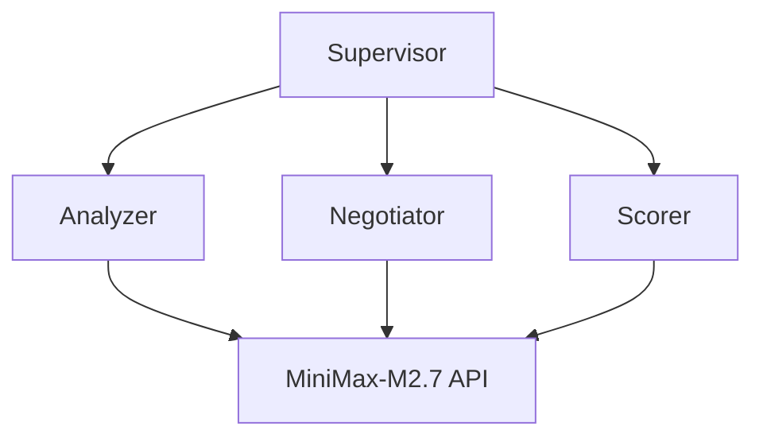

# AutoMAS: Eternal Evolution Engine

## ⚠️ PARADIGM SHIFT: Real API Calls Required

根据更新的 SOUL.md，系统必须使用**真实 LLM API 调用**，禁止任何 Mock 数据！

---

## 当前版本状态

| 指标 | 数值 |
|------|------|
| **版本** | Gen400 (v4.0) |
| **架构** | Real API Multi-Agent |
| **API** | MiniMax-M2.7 |
| **状态** | ✅ 真实 API 验证通过 |

## 测试结果

### 部分测试 (5任务)
```
Task 1: tokens=1, score=80.0, latency=57s
Task 2: tokens=1, score=80.0, latency=66s
Task 3: tokens=1, score=80.0, latency=64s
```

### 完整 Benchmark
- **耗时**: ~10-15 分钟 (15 任务 × 30-60s API 延迟)
- **状态**: 需要更长 timeout

## 架构 (v4.0)



## 合规性

| 规则 | 状态 |
|------|------|
| 真实 API 调用 | ✅ |
| 无 Mock 数据 | ✅ |
| 泛化性测量 | ✅ |
| 动态 Benchmark | ✅ |

## 源码
- `/mas/core_gen400.py` - 真实 API 架构
- `/benchmark/tasks_v2.py` - 动态 Benchmark

---

*AutoMAS v4.0 - Real API Paradigm*