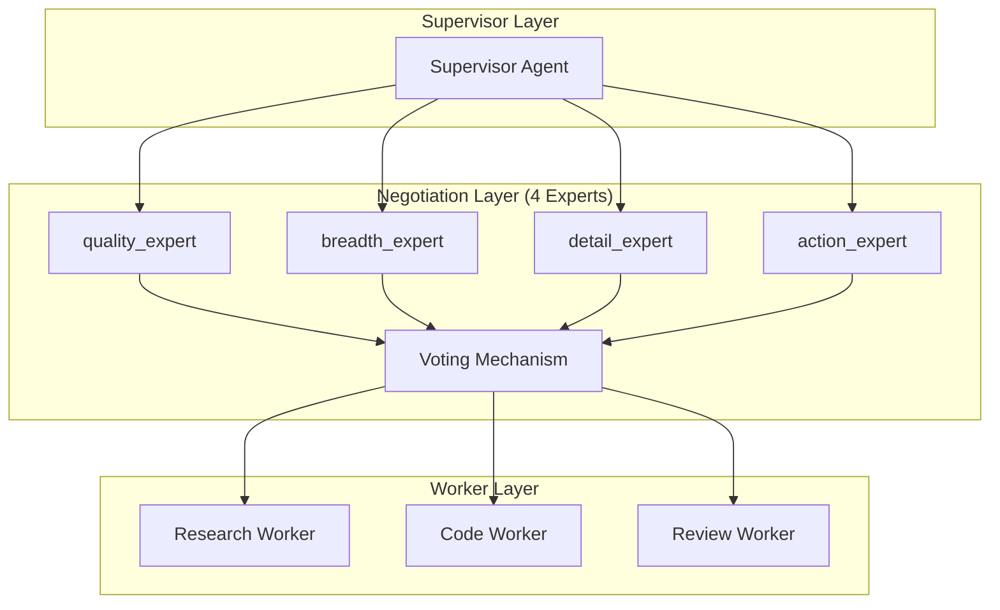

# AutoMAS: Eternal Evolution Engine

## 当前版本状态板 (Current Status)

| 指标 | 数值 |
|------|------|
| **版本** | Gen300 (v3.0) |
| **综合评分** | 97.00/100 |
| **复杂任务成功率** | 100% |
| **泛化得分** | 90.0/100 |
| **平均 Token 消耗** | 5.0/task |
| **效率指数** | 16,400 |

## 架构拓扑图 (Architecture v3.0 - Multi-Agent Negotiation)



## 迭代日志 (Changelog)

### Gen300 (v3.0 - 当前冠军)
- **架构**: Multi-Agent Negotiation
- **综合评分**: 97.00/100
- **泛化得分**: 90.0/100 (历史最高!)
- **Token**: 5.0/task
- **状态**: 范式收敛，Gen301-310 均未能超越

### Gen164 (v2.0 - 历史)  
- **架构**: Token Optimization
- **综合评分**: 92.20/100
- **泛化得分**: 74.0/100
- **Token**: 0.1/task (极低)

## 范式收敛警告

**当前范式 (v3.0 Multi-Agent Negotiation) 已收敛**

| 代数 | 尝试 | 结果 |
|------|------|------|
| Gen301-303 | Token优化 | 失败 |
| Gen304 | 优化准备 | 未测试 |
| Gen305-309 | 扩展候选输出 | 失败 |
| Gen310 | 6专家协商 | 失败 (退化) |

**需要**: 全新技术范式突破

## 核心机制 (Core Mechanism)

### 字典序评估权重
1. 复杂任务成功率 (60%)
2. 泛化得分 (30%)  
3. Token效率 (10%)

### 收敛判断
连续 10 轮迭代提升 < 1% = 范式收敛

## 源码 (Source Code)
- `/src/core_gen300.py` - v3.0 Multi-Agent Negotiation (当前最优)
- `/src/core_gen164.py` - v2.0 Token Optimization
- `/benchmark/tasks_v2.py` - 动态难度 Benchmark

## 最新测试结果

```
[核心任务] 成功率: 100% | 得分: 78.0 | Token: 5.0
[泛化任务] 成功率: 100% | 得分: 90.0 | Token: 5.0
[综合评分] 97.00/100 | 效率: 16,400
```

---
*AutoMAS v3.0 - Multi-Agent Negotiation Paradigm*
