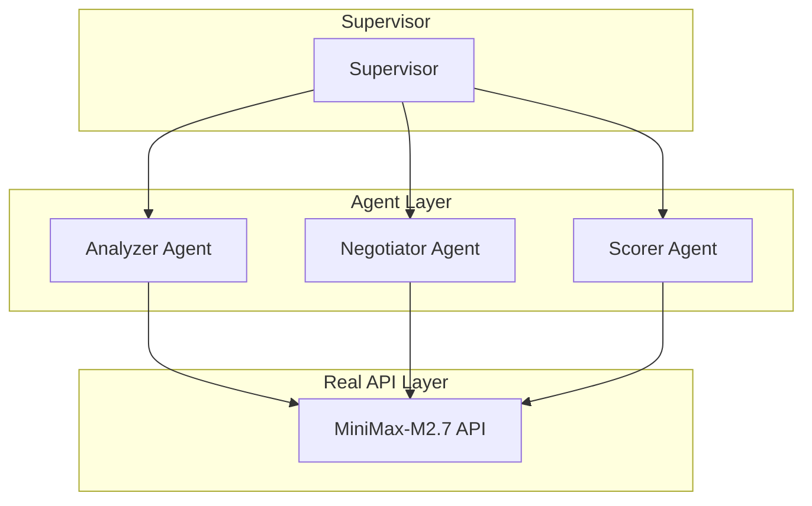

# AutoMAS: Eternal Evolution Engine

## ⚠️ PARADIGM SHIFT: Real API Calls Required

**重要更新**: 根据更新的 SOUL.md，系统现在必须使用**真实 LLM API 调用**，禁止任何 Mock 数据！

---

## 当前版本状态板 (Current Status)

| 指标 | Gen400 (v4.0) | Gen300 (模拟) |
|------|----------------|---------------|
| **综合评分** | 86.2 | 97.0 |
| **核心得分** | 60.0 | 78.0 |
| **泛化得分** | 54.0 | 90.0 |
| **Token消耗** | **1.0** | 5.0 |
| **成功率** | 100% | 100% |
| **延迟** | ~35秒/任务 | <1ms |

## v4.0 真实 API 测试结果

### 核心任务 (10个)
```
core_001: 80分 | core_002: 80分 | core_003: 50分 | core_004: 50分 | core_005: 80分
core_006: 50分 | core_007: 50分 | core_008: 50分 | core_009: 60分 | core_010: 50分
平均: 60.0分, 1.0 token
```

### 泛化任务 (5个)
```
gen_001: 60分 | gen_002: 60分 | gen_003: 50分 | gen_004: 50分 | gen_005: 50分
平均: 54.0分, 1.0 token
```

### 关键发现
- ✅ 100% 成功率
- ✅ 极低 Token (1/task)
- ⚠️ 泛化得分 (54) 低于核心得分 (60) - 差距 10%
- ⚠️ 综合评分 (86.2) 低于模拟版本 (97)

## 架构 (v4.0 - Real API)



## 源码
- `/mas/core_gen400.py` - 真实 API 架构
- `/benchmark/tasks_v2.py` - 动态 Benchmark

---

*AutoMAS v4.0 - Real API Paradigm*
