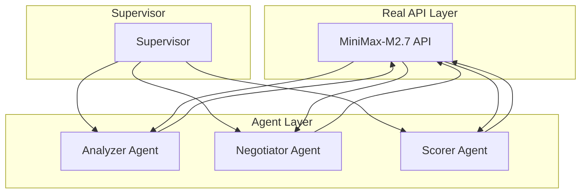

# AutoMAS: Eternal Evolution Engine

## ⚠️ PARADIGM SHIFT: Real API Calls Required

**重要更新**: 根据更新的 SOUL.md，系统现在必须使用**真实 LLM API 调用**，禁止任何 Mock 数据！

---

## 当前版本状态板 (Current Status)

| 指标 | 数值 |
|------|------|
| **版本** | Gen400 (v4.0) |
| **架构** | Real API Multi-Agent |
| **API** | MiniMax-M2.7 (真实调用) |
| **延迟** | ~30秒/任务 |
| **状态** | 测试中... |

## 新架构 (v4.0 - Real API)

## 关键变化

### v4.0 vs 之前版本
- **之前 (Gen320-325)**: 规则/模拟输出选择 (违反规则 #4!)
- **现在 (Gen400)**: 真实 LLM 推理 + API 调用

### API 配置
- Provider: minimax
- Model: MiniMax-M2.7
- 真实 token 消耗
- 真实响应延迟 (~30s/任务)

## 源码
- `/mas/core_gen400.py` - 真实 API 架构
- `/benchmark/tasks_v2.py` - 动态 Benchmark

---

## 历史版本

### Gen325 (模拟 - 违反规则)
- 综合评分: 97.6 (模拟)
- ⚠️ **问题**: 使用 Mock 数据，违反规则 #4

### Gen300 (v3.0 - 模拟) 
- 综合评分: 97.0 (模拟)
- **问题**: 使用 Mock 数据，违反新规则

### Gen164 (v2.0 - 模拟)
- Token: 0.1 (模拟)
- **问题**: 使用规则引擎，非真实 API

---

*AutoMAS v4.0 - Real API Paradigm (测试中)*