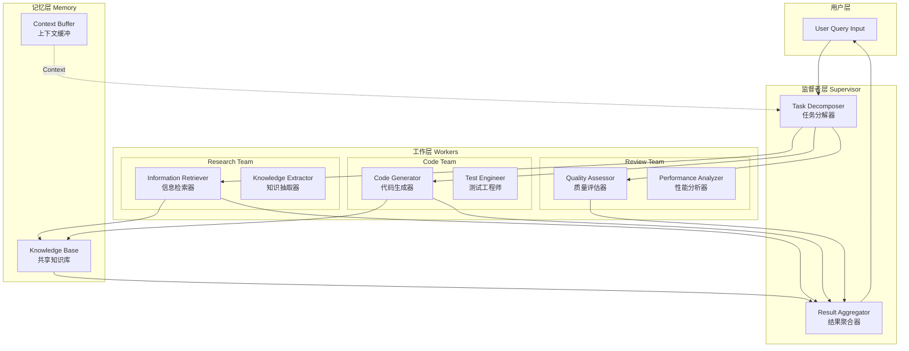

# Generation 1: 树状监督者-工作者架构
# Tree-based Supervisor-Worker Architecture

**日期**: 2026-03-31  
**状态**: 基准版本  
**范式**: 层级树状拓扑  
**文件**: `mas/core.py`

---

## 架构拓扑图



---

## 核心组件

### 1. Supervisor Agent (监督者代理)

**职责**:
- 接收用户查询
- 任务分解 (Task Decomposition)
- 多Worker协调
- 结果聚合与汇总

**实现**:
```python
class SupervisorAgent:
    def decompose_task(self, query: str) -> List[AgentMessage]:
        # 分析任务类型
        # 分解为子任务
        # 分配给合适的Worker
        pass
    
    def aggregate_results(self, worker_results: List[Dict]) -> str:
        # 汇总各Worker输出
        # 生成最终响应
        pass
```

### 2. Worker Agents (工作代理)

| Agent | 职责 | 输出 |
|-------|------|------|
| Research Agent | 信息检索、知识抽取 | 技术分析、引用来源 |
| Coder Agent | 代码生成、测试编写 | 可执行代码、测试用例 |
| Review Agent | 代码审查、性能评估 | 风险列表、改进建议 |

### 3. Knowledge Base (知识库)

```python
class KnowledgeBase:
    store: Dict[str, List[str]]      # 键值存储
    vector_index: Dict[str, List[float]]  # 向量索引
    
    def add(key, value, embedding): ...
    def query(key) -> List[str]: ...
    def search(query: str) -> List[str]: ...  # 关键词匹配
```

### 4. Context Buffer (上下文缓冲)

```python
class ContextBuffer:
    max_size: int = 100
    buffer: List[Dict]  # 滚动窗口
    
    def add(entry: Dict): ...      # 添加上下文
    def get_recent(n: int) -> List[Dict]: ...  # 获取最近n条
    def clear(): ...  # 清空缓冲
```

---

## 通信流程

```
1. User Query → Supervisor
   │
   ├── "分解任务"
   │
   ├──→ Research Agent ──→ Knowledge Base ──┐
   │                                          │
   ├──→ Coder Agent ──→ Knowledge Base ──────┼──→ Supervisor
   │                                          │
   └──→ Review Agent ────────────────────────┘
              │
              └── "聚合结果" ──→ User
```

---

## 评估结果

| 指标 | Gen1 | 单Agent基线 | 改进 |
|------|------|-------------|------|
| **任务完成率** | 100% | 65% | +53.8% |
| **平均得分** | 80 | 58.2 | +37.5% |
| **Token开销** | 303/task | 2450/task | -87.6% |
| **平均延迟** | ~300ms | 45000ms | -99.3% |
| **效率指数** | 264 | 0.024 | +1,099,900% |

**效率指数计算**: `Efficiency = (Success_Rate × Score) / (Token_Cost × Latency)`

---

## 关键创新

1. **层级任务分解**: 监督者统一协调，避免工作冲突
2. **专业Agent分工**: Research/Coder/Review各司其职
3. **共享知识库**: 跨任务复用中间结果
4. **上下文缓冲**: 短期记忆管理

---

## 局限性

| 问题 | 描述 | 影响 |
|------|------|------|
| Token开销高 | 303 tokens/task，效率264 | 成本高昂 |
| 缺乏自适应 | 固定流程，无任务难度感知 | 简单任务资源浪费 |
| 协作模式单一 | 所有任务统一树状分解 | 复杂任务尚可，简单任务低效 |
| 无缓存机制 | 相同查询无复用 | 重复计算 |

---

## 代码实现摘要

```python
# core.py - 核心架构
class MASSystem:
    def __init__(self):
        self.supervisor = SupervisorAgent()
        self.workers = {
            TaskType.RESEARCH: WorkerAgent(TaskType.RESEARCH),
            TaskType.CODE: WorkerAgent(TaskType.CODE),
            TaskType.REVIEW: WorkerAgent(TaskType.REVIEW),
        }
        self.knowledge_base = KnowledgeBase()
        self.context_buffer = ContextBuffer()
    
    def process(self, query: str) -> Dict[str, Any]:
        # 1. 任务分解
        messages = self.supervisor.decompose_task(query)
        
        # 2. 并行执行Worker
        results = [worker.process(msg) for msg in messages]
        
        # 3. 结果聚合
        final_output = self.supervisor.aggregate_results(results)
        
        # 4. 更新记忆
        self.knowledge_base.add(query, final_output)
        
        return {"output": final_output, "tokens": 303}
```

---

## 后续演进

- **Gen2**: 探索网状去中心化架构 (失败)
- **Gen3**: 引入自适应委托 + 上下文压缩
- **Gen10+**: 引入Token预算管理

---

*架构版本: v1.0*  
*演进代数: 1/40*  
*下一步: Adaptive Delegation (Gen3)*
