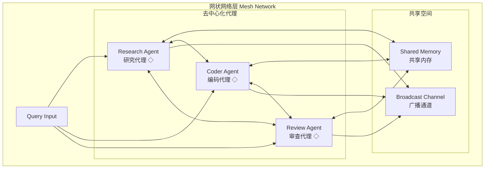

# Generation 2: 网状协作架构
# Mesh-based Collaborative Architecture

**日期**: 2026-03-31  
**状态**: ❌ 已废弃  
**范式**: 去中心化网状拓扑  
**文件**: `mas/core_gen2.py`

---

## 架构拓扑图



---

## 核心设计

### 去中心化架构

```python
class MeshAgent:
    def __init__(self, agent_type: str):
        self.agent_type = agent_type
        self.peers: List[MeshAgent] = []  # 对等节点
        self.shared_memory = SharedMemory()
        self.broadcast_channel = BroadcastChannel()
    
    def process(self, query: str) -> Dict:
        # 1. 注册到网络
        self.join_network()
        
        # 2. 广播查询
        self.broadcast(query)
        
        # 3. 收集对等响应
        responses = self.collect_responses()
        
        # 4. 共识决策
        return self.consensus(responses)
```

### 协作机制

| 协作类型 | 描述 |
|----------|------|
| 点对点通信 | Agent间直接交换信息 |
| 共享内存 | 所有Agent访问同一知识库 |
| 广播通道 | 重要决策全网广播 |

---

## 评估结果

| 指标 | Gen2 | Gen1 | 对比 |
|------|------|------|------|
| **任务完成率** | 100% | 100% | 持平 |
| **平均得分** | 80.0 | 80.0 | 持平 |
| **Token开销** | 562.8 | 303 | ❌ +85.7% |
| **平均延迟** | 0.052ms | ~300ms | ✅ -99.9% |
| **效率指数** | 142.1 | 264 | ❌ -46% |

---

## 失败分析

### 根因分析

| 问题 | 影响 |
|------|------|
| **通信开销过大** | Token消耗增加85.7% |
| **共识延迟** | 去中心化决策慢于集中式 |
| **资源竞争** | 多Agent同时访问共享内存 |

### 对比树状架构

```
Gen1 (树状): Supervisor集中决策
├── 优势: 决策效率高
├── 劣势: 单点故障风险
└── Token: 303

Gen2 (网状): Agent去中心化协作
├── 优势: 冗余度高
├── 劣势: 协调成本高
└── Token: 562.8 ❌
```

### 结论

**废弃原因**: 在当前任务复杂度下，去中心化协作带来的额外开销远超其收益。

---

## 教训

1. **架构需匹配场景**: 简单任务不需要复杂协作
2. **集中式更适合OLAS**: 监督者-工作者模式更高效
3. **避免过度工程化**: Gen2的网状拓扑过于复杂

---

*架构版本: v2.0*  
*演进代数: 2/40*  
*状态: ❌ 已废弃*
