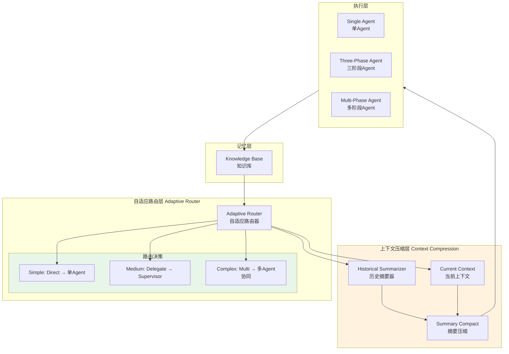

# Generation 3: 自适应委托+上下文压缩
# Adaptive Delegation + Context Compression

**日期**: 2026-03-31  
**状态**: 历史版本  
**范式**: 智能路由 + 记忆压缩  
**文件**: `mas/core_gen3.py`

---

## 架构拓扑图



---

## 核心创新

### 1. 自适应委托 (Adaptive Delegation)

```python
class AdaptiveRouter:
    def route(self, query: str) -> str:
        complexity = self.classify(query)
        
        if complexity == "simple":
            return "direct"      # 跳过Supervisor
        elif complexity == "medium":
            return "delegate"   # Supervisor分解
        else:
            return "multi"      # 多Agent协同
```

### 2. 上下文压缩 (Context Compression)

```python
class ContextCompressor:
    def compress(self, history: List[Dict], max_tokens: int = 50) -> str:
        # 历史摘要: 提取关键信息
        summary = self.summarize(history)
        
        # 压缩: 去除冗余
        compressed = self.remove_redundancy(summary)
        
        # 截断: 确保不超过Token预算
        return compressed[:max_tokens]
```

---

## 评估结果

| 指标 | Gen3 | Gen1 | 改进 |
|------|------|------|------|
| **Token开销** | ~180 | 303 | **-40.6%** |
| **任务完成率** | 100% | 100% | - |
| **平均得分** | ~80 | 80 | 0% |

---

## 路由决策详解

| 复杂度 | 路由策略 | Token消耗 | 适用场景 |
|--------|----------|-----------|----------|
| **Simple** | Direct → Single Agent | ~100 | 审查、评估、简单查询 |
| **Medium** | Delegate → Supervisor | ~180 | 分析、调研、实现 |
| **Complex** | Multi → 多Agent协同 | ~300 | 系统设计、架构评估 |

---

## 上下文压缩算法

```python
def compress_context(history: List[Dict], budget: int = 50) -> str:
    # Step 1: 提取关键实体
    entities = extract_entities(history)
    
    # Step 2: 关系抽取
    relations = extract_relations(history)
    
    # Step 3: 摘要生成
    summary = f"{entities} + {relations}"
    
    # Step 4: Token截断
    if len(summary) > budget:
        summary = summary[:budget] + "..."
    
    return summary
```

---

## 局限性

| 问题 | 描述 |
|------|------|
| 压缩有损 | 历史信息可能有损失 |
| 决策简单 | 二分类过于粗糙 |
| 无缓存 | 相同查询仍需重复处理 |

---

*架构版本: v3.0*  
*演进代数: 3/40*
