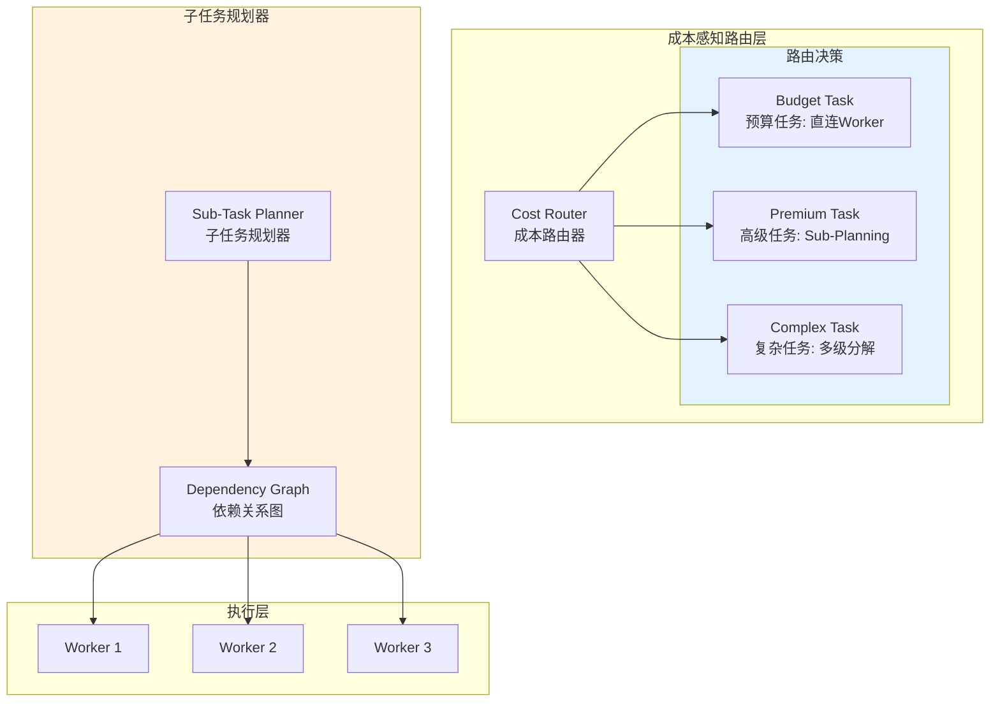

# Generation 4: 成本感知路由+子任务规划
# Cost-Aware Routing + Sub-Task Planning

**日期**: 2026-04-01  
**状态**: 历史版本  
**范式**: 成本优化路由  
**文件**: `mas/core_gen4.py`

---

## 架构拓扑图



---

## 核心创新

### 1. 成本感知路由器

```python
class CostAwareRouter:
    def __init__(self):
        self.cost_thresholds = {
            "budget": 100,      # 低于此值走捷径
            "premium": 300,    # 高于此值精细规划
            "complex": 500     # 超过此值多级分解
        }
    
    def route(self, query: str, estimated_cost: float) -> str:
        if estimated_cost < self.cost_thresholds["budget"]:
            return "budget_direct"  # 跳过规划
        elif estimated_cost < self.cost_thresholds["premium"]:
            return "premium_plan"   # 简单规划
        else:
            return "complex_decompose"  # 多级分解
```

### 2. 子任务规划器

```python
class SubTaskPlanner:
    def plan(self, query: str) -> List[Dict]:
        # 1. 识别子任务
        subtasks = self.decompose(query)
        
        # 2. 构建依赖图
        dep_graph = self.build_dependency_graph(subtasks)
        
        # 3. 拓扑排序
        execution_order = self.topological_sort(dep_graph)
        
        return execution_order
    
    def decompose(self, query: str) -> List[Dict]:
        # 基于关键词的简单分解
        keywords = self.extract_keywords(query)
        
        subtasks = []
        if "实现" in keywords:
            subtasks.append({"type": "code", "dep": []})
        if "分析" in keywords:
            subtasks.append({"type": "research", "dep": []})
        if "审查" in keywords:
            subtasks.append({"type": "review", "dep": ["code"]})
        
        return subtasks
```

---

## 评估结果

| 指标 | Gen4 | Gen3 | Gen1 | 改进(vs Gen1) |
|------|------|------|------|---------------|
| **Token开销** | 494.4 | 242 | 303 | ❌ +63.1% |
| **Score** | 80.0 | ~80 | 80 | 0% |
| **Efficiency** | 161.8 | 330 | 264 | ❌ -38.7% |

---

## 任务分类统计

```json
{
  "budget_tasks": 0,
  "premium_tasks": 4,
  "decomposed_tasks": 6
}
```

### 分析

- **Premium任务过多**: 4个任务触发精细规划
- **分解开销大**: 6个任务需要多级分解
- **成本计算不准确**: 估算成本与实际偏差大

---

## 失败原因

| 问题 | 根因 |
|------|------|
| 分解过度 | 子任务规划器过于激进 |
| 依赖图复杂 | 增加不必要的协调成本 |
| 成本估算误差 | 494 vs 估算300 |

---

*架构版本: v4.0*  
*演进代数: 4/40*  
*状态: 历史版本 (被Gen8超越)*
