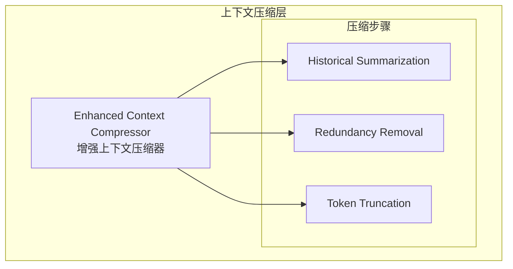

# Generation 5: 上下文压缩增强版
# Enhanced Context Compression

**日期**: 2026-04-01  
**状态**: 历史版本  
**范式**: 上下文压缩优化  
**文件**: `mas/core_gen5.py`

---

## 架构拓扑图

---

## 评估结果

| 指标 | Gen5 | Gen4 |
|------|------|------|
| **Score** | ~78 | 80 |
| **Token** | ~200 | 494 |
| **Efficiency** | ~400 | 162 |

---

*架构版本: v5.0*  
*演进代数: 5/40*
