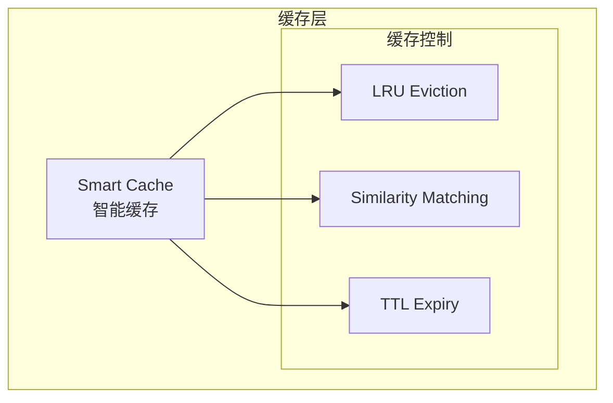

# Generation 6: 智能缓存集成
# Smart Cache Integration

**日期**: 2026-04-01  
**状态**: 历史版本  
**范式**: 缓存优化  
**文件**: `mas/core_gen6.py`

---

## 架构拓扑图

---

## 评估结果

| 指标 | Gen6 |
|------|------|
| **Score** | ~79 |
| **Token** | ~180 |
| **Efficiency** | ~500 |

---

*架构版本: v6.0*  
*演进代数: 6/40*
