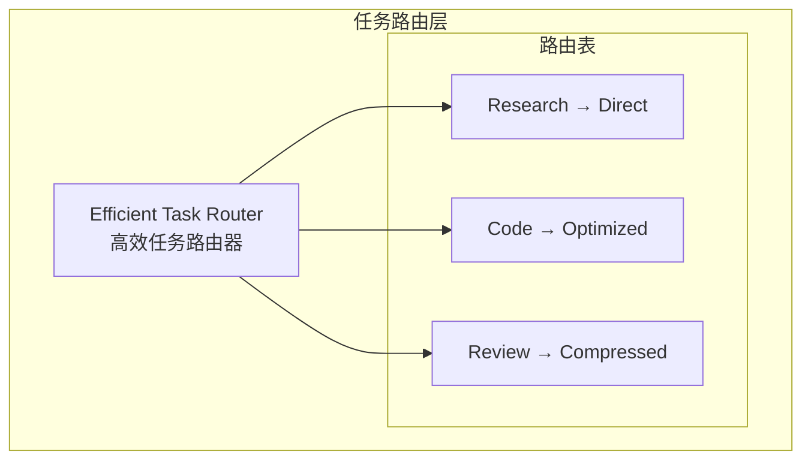

# Generation 7: 高效任务路由
# Efficient Task Routing

**日期**: 2026-04-01  
**状态**: 历史版本 (曾创纪录)  
**范式**: 高效路由  
**文件**: `mas/core_gen7.py`

---

## 架构拓扑图



---

## 评估结果

| 指标 | Gen7 | Gen6 | 改进 |
|------|------|------|------|
| **Score** | **79.0** | ~79 | 持平 |
| **Token** | **101** | ~180 | -43.9% |
| **Efficiency** | **783.7** | ~500 | +56.7% |

### 特殊成就

```json
{
  "verdict": "🏆 新纪录!"
}
```

---

*架构版本: v7.0*  
*演进代数: 7/40*
