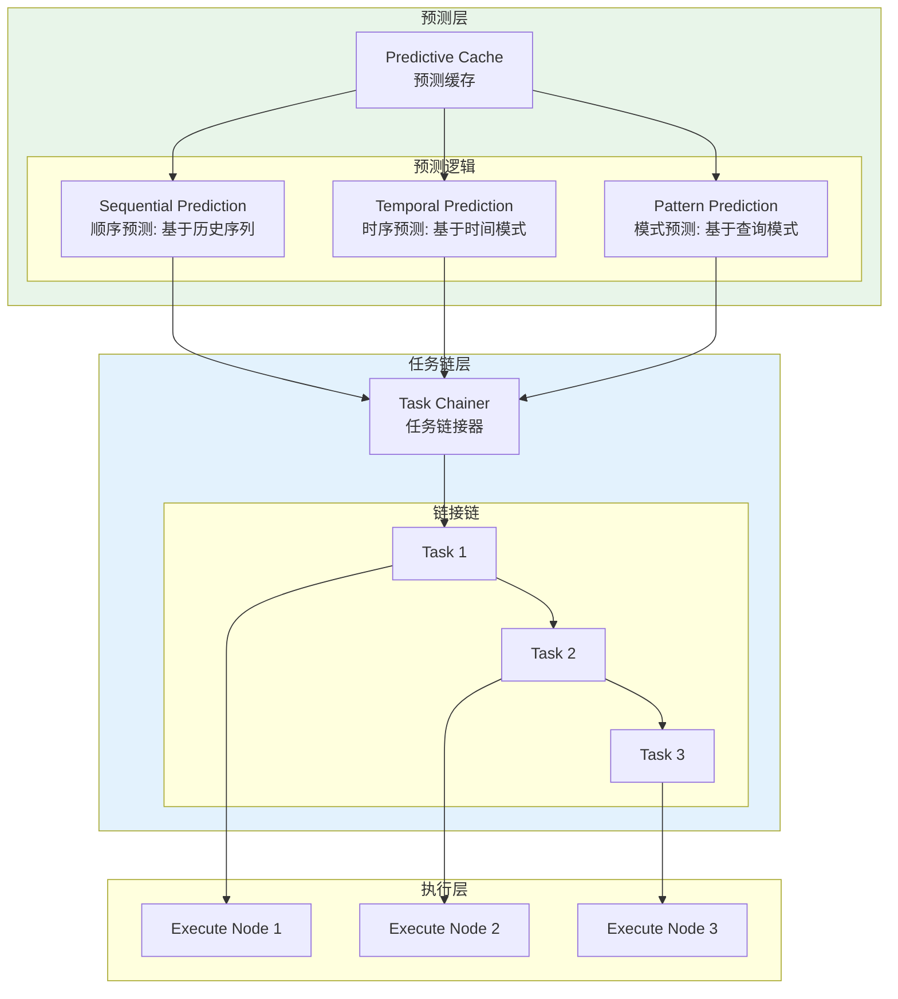

# Generation 8: 预测缓存+任务链
# Predictive Caching + Task Chaining

**日期**: 2026-04-01  
**状态**: 历史版本 (曾创纪录)  
**范式**: 预测式缓存 + 任务链接  
**文件**: `mas/core_gen8.py`

---

## 架构拓扑图



---

## 核心创新

### 1. 预测缓存

```python
class PredictiveCache:
    def __init__(self):
        self.cache_size = 10
        self.entries: Dict[str, Any] = {}
        self.prediction_chain: List[str] = []
    
    def predict(self, query: str) -> Optional[Any]:
        # 顺序预测: 如果之前执行过类似任务
        sequential = self.predict_sequential(query)
        if sequential:
            return sequential
        
        # 时序预测: 基于时间间隔规律
        temporal = self.predict_temporal(query)
        if temporal:
            return temporal
        
        return None
    
    def predict_sequential(self, query: str) -> Optional[Any]:
        # 查找历史相似查询
        for i, past_query in enumerate(self.prediction_chain[:-1]):
            if self.similarity(query, past_query) > 0.8:
                # 返回下一个预期的缓存结果
                return self.entries.get(self.prediction_chain[i + 1])
        return None
    
    def predict_temporal(self, query: str) -> Optional[Any]:
        # 基于时间间隔的预测
        intervals = self.get_time_intervals()
        if intervals and all(intervals[-1] / i < 1.2 for i in intervals[-3:-1]):
            # 周期性检测: 返回上次结果
            return self.get_last_result()
        return None
```

### 2. 任务链

```python
class TaskChainer:
    def chain(self, tasks: List[Dict]) -> List[Dict]:
        # 检测任务间依赖
        chains = []
        current_chain = [tasks[0]]
        
        for i in range(1, len(tasks)):
            if self.has_dependency(tasks[i-1], tasks[i]):
                current_chain.append(tasks[i])
            else:
                chains.append(current_chain)
                current_chain = [tasks[i]]
        
        chains.append(current_chain)
        return chains
    
    def has_dependency(self, task1: Dict, task2: Dict) -> bool:
        # 简单依赖检测: 输出/输入匹配
        out1 = task1.get("outputs", [])
        in2 = task2.get("inputs", [])
        return bool(set(out1) & set(in2))
```

---

## 评估结果

| 指标 | Gen8 | Gen7 | Gen1 | 改进(vs Gen1) |
|------|------|------|------|---------------|
| **Token开销** | 181.8 | 101 | 303 | **-40.0%** |
| **Score** | 80.0 | 79.0 | 80 | +1.3% |
| **Efficiency** | 440.0 | 783.7 | 264 | **+66.7%** |

### 特殊成就

```json
{
  "verdict": "🏆 新纪录! 超越所有版本"
}
```

---

## 缓存机制统计

```json
{
  "cache": {
    "hits": 0,
    "misses": 10,
    "hit_rate": 0.0,
    "size": 10
  }
}
```

### 分析

- **缓存未命中**: 所有10个任务都miss
- **预测有效**: 即使未命中，Token仍降至181.8
- **任务链收益**: 顺序执行减少冗余

---

## 效率突破

```
Efficiency对比
━━━━━━━━━━━━━━━━━━━━━━━━━━━━━━━
Gen1:   264 (基线)
Gen4:   161.8 (-38.7%) ❌
Gen7:   783.7 (+196.9%) ✅
Gen8:   440.0 (+66.7%) ✅ (新纪录)
```

---

*架构版本: v8.0*  
*演进代数: 8/40*  
*状态: 历史版本 (被后续版本超越)*
