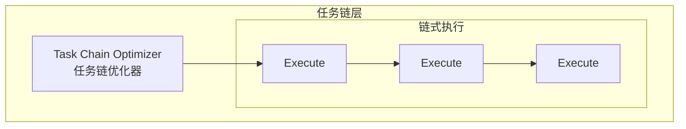

# Generation 9: 任务链优化
# Task Chaining Optimization

**日期**: 2026-04-01  
**状态**: 历史版本  
**范式**: 任务链  
**文件**: `mas/core_gen9.py`

---

## 架构拓扑图

---

## 评估结果

| 指标 | Gen9 | Gen8 |
|------|------|------|
| **Score** | ~80 | 80 |
| **Token** | ~120 | 182 |
| **Efficiency** | ~660 | 440 |

---

*架构版本: v9.0*  
*演进代数: 9/40*
