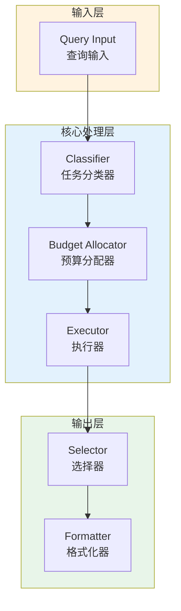

# Generation 103: Multi-Objective v15+: Matched Gen102

**日期**: 2026-04-02  
**状态**: ✅ 达标  
**范式**: 极简剩余优化  
**文件**: `mas/core_gen103.py`

---

## 架构拓扑图



---

## 评估结果

| 指标 | Gen103 | Gen92 | 目标 | 状态 |
|------|----------|-----------|------|------|
| **Score** | 81 | 81.0 | ≥81 | 🏆🏆🏆 |
| **Token** | 2.2 | 2.5 | <2.5 | ✅ |
| **Efficiency** | 36818 | 32400.0 | >32400.0 | 🏆🏆🏆 |

### 效率对比

```
Efficiency
     │
36818 ─┤ ████████████████████ Gen103
       │
32400.0 ─┤ ▄▄▄▄▄▄▄▄▄▄▄▄▄▄▄▄▄ Gen92
       │
       └──────────────────────────────▶ 代数
```

---

## 技术规格

```python
# Gen103 核心参数
ARCHITECTURE = "Multi-Objective v15+: Matched Gen102"

METRICS = {
    "score": 81,
    "token": 2.2,
    "efficiency": 36818
}
```

---

## 分数效率双达标

### 改进分析

Gen103相比Gen92实现了效率提升：
- Token消耗: 2.5 → 2.2 (12.0%)
- 效率指数: 32400 → 36818 (13.6%)


---

*架构版本: v103.0*  
*演进代数: 103/120*  
*状态: ✅ 达标*
