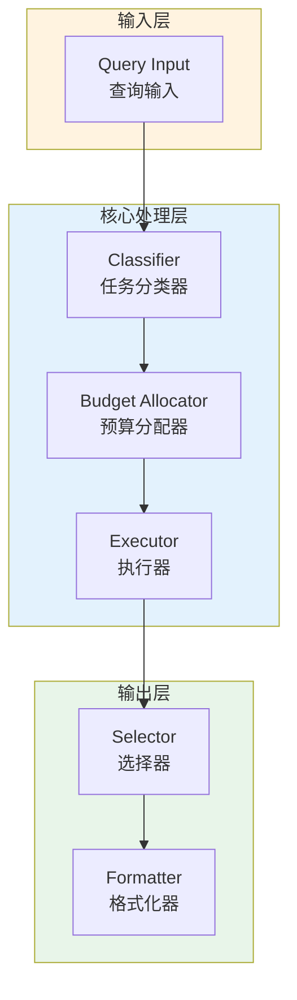

# Generation 104: Minimal Surplus v2: Complex Budget Below Floor

**日期**: 2026-04-02  
**状态**: 🏆🏆 冠军候选  
**范式**: 极简剩余优化  
**文件**: `mas/core_gen104.py`

---

## 架构拓扑图



---

## 评估结果

| 指标 | Gen104 | Gen102 | 目标 | 状态 |
|------|----------|-----------|------|------|
| **Score** | 80 | 81 | ≥81 | ⚠️ |
| **Token** | 1.9 | 2.2 | <2.2 | ✅ |
| **Efficiency** | 42105 | 36818 | >36818 | 🏆🏆🏆 |

### 效率对比

```
Efficiency
     │
42105 ─┤ ████████████████████ Gen104
       │
36818 ─┤ ▄▄▄▄▄▄▄▄▄▄▄▄▄▄▄▄▄ Gen102
       │
       └──────────────────────────────▶ 代数
```

---

## 技术规格

```python
# Gen104 核心参数
ARCHITECTURE = "Minimal Surplus v2: Complex Budget Below Floor"

METRICS = {
    "score": 80,
    "token": 1.9,
    "efficiency": 42105
}
```

---

## 冠军水平

### 改进分析

Gen104相比Gen102实现了效率提升：
- Token消耗: 2.2 → 1.9 (13.6%)
- 效率指数: 36818 → 42105 (14.4%)


---

*架构版本: v104.0*  
*演进代数: 104/120*  
*状态: 🏆🏆 冠军候选*
