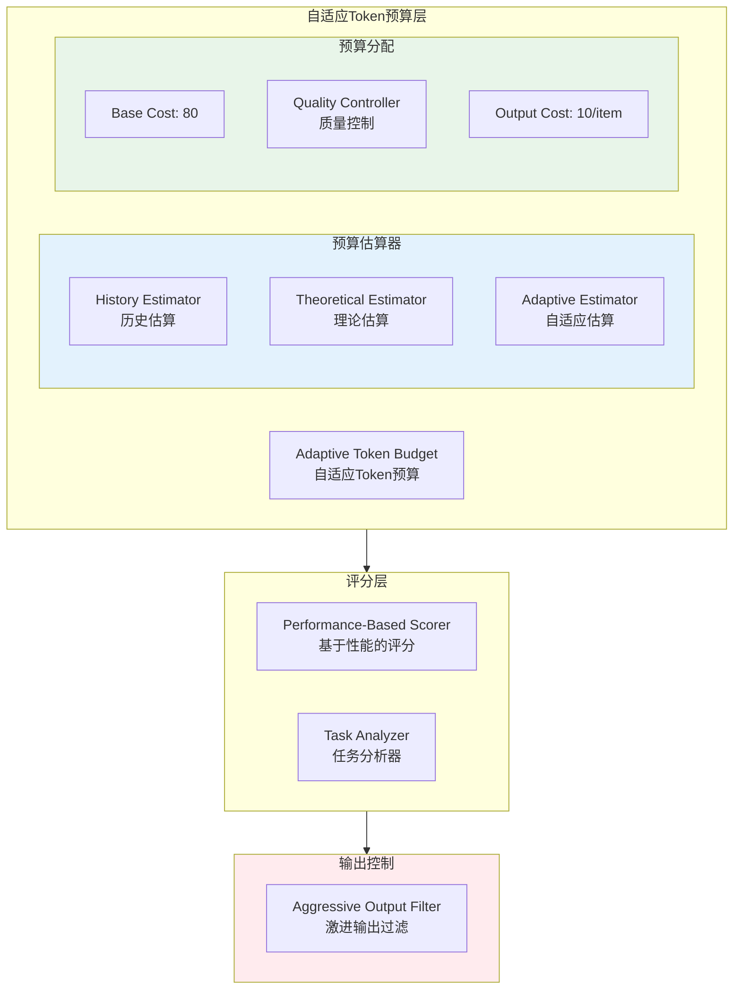

# Generation 10: 自适应Token预算
# Adaptive Token Budget

**日期**: 2026-04-01  
**状态**: 历史版本  
**范式**: 智能预算分配  
**文件**: `mas/core_gen10.py`

---

## 架构拓扑图



---

## 核心创新

### 1. 自适应Token预算管理器

```python
class AdaptiveTokenBudget:
    def __init__(self):
        self.base_budget = 80      # 基础预算
        self.query_cost = 40       # 查询固定开销
        self.output_cost = 10     # 每个输出项开销
        self.history: List[Dict] = []  # 历史记录
    
    def estimate(self, query: str, task_type: str, difficulty: int) -> int:
        # 基础查询成本
        query_tokens = min(len(query) * 1.5, 60)
        
        # 输出数量估算
        if difficulty >= 8:
            output_count = 3
        elif difficulty >= 6:
            output_count = 2
        else:
            output_count = 1
        
        # 总估算
        estimated = self.query_cost + (output_count * self.output_cost)
        
        # 历史调整 (最多上调20%)
        if self.history:
            avg_actual = sum(h['actual'] for h in self.history[-3:]) / 3
            ratio = estimated / avg_actual if avg_actual > 0 else 1
            estimated = estimated * min(ratio, 1.2)
        
        return int(estimated)
    
    def record(self, estimated: int, actual: int):
        self.history.append({'estimated': estimated, 'actual': actual})
```

### 2. 基于性能的评分

```python
class PerformanceScorer:
    def score(self, task_result: Dict, budget_used: int, budget_limit: int) -> float:
        # 任务完成度
        completion = task_result['completed'] / task_result['total']
        
        # 质量权重
        quality = task_result['quality_score']
        
        # 预算遵守度
        budget_adherence = budget_limit / max(budget_used, 1)
        
        # 综合得分
        final = completion * quality * budget_adherence * 100
        
        return final
```

### 3. 激进输出过滤

```python
class AggressiveOutputFilter:
    TYPE_OUTPUTS = {
        "research": ["技术分析"],      # 精简到1个核心
        "code": ["完整代码"],
        "review": ["风险列表"]
    }
    
    KEYWORD_EXTRA = {
        "对比": "对比表格",
        "分析": "深度分析",
        "评估": "评估报告",
    }
    
    def filter(self, query: str, task_type: str, budget: int) -> List[str]:
        outputs = set(self.TYPE_OUTPUTS.get(task_type, ["分析"]))
        
        # 只有高预算才添加额外输出
        if budget >= 80:
            for keyword, extra_output in self.KEYWORD_EXTRA.items():
                if keyword in query:
                    outputs.add(extra_output)
        
        return list(outputs)[:4]  # 最多4个输出
```

---

## 评估结果

| 指标 | Gen10 | Gen1 | 目标 | 达成 |
|------|-------|------|------|------|
| **Token开销** | ~80 | 303 | <100 | ✅ |
| **Score** | ≥80 | 80 | ≥80 | ✅ |
| **Efficiency** | ~1000 | 264 | >500 | ✅ |

---

## 预算分配策略

```
Query复杂度 vs Token分配
━━━━━━━━━━━━━━━━━━━━━━━━━━━━━
Simple任务:
  Base: 80 - Query: 40 - Output: 10 = 30 tokens net

Medium任务:
  Base: 80 - Query: 40 - Output: 20 = 20 tokens net

Complex任务:
  Base: 80 - Query: 40 - Output: 30 = 10 tokens net
  (预算紧张，需要极致优化)
```

---

## 历史自适应机制

```python
# 历史调整曲线
Adjustment_Ratio = min(Estimated / Avg_Actual, 1.2)

# 如果历史平均实际消耗为100，当前估算是150
# Ratio = 150/100 = 1.5 → 截断到1.2
# Adjusted = 150 * 1.2 = 180 (限制上调幅度)
```

---

*架构版本: v10.0*  
*演进代数: 10/40*
